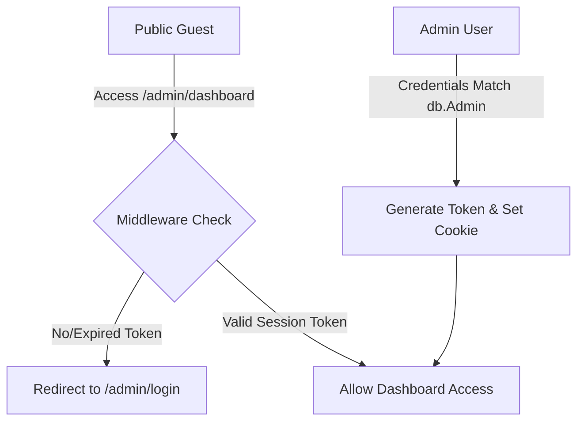

# AUTHENTICATION FLOW AUDIT
### Dragon Up — Portal Session & Security Review

---

## 1. Authentication Status Overview

This report documents the architectural structure of security, credentials verification, sessions, and route protection mechanisms implemented in the Dragon Up codebase.

| Audit Question | Audit Result | Detailed Findings |
| :--- | :---: | :--- |
| **1. Is there an Admin Login page?** | ✅ YES | Located at `/admin/login`. |
| **2. Is there a Content Manager Login page?** | ❌ NO | No separate page or credentials validation exists for Content Managers. |
| **3. Which roles currently exist?** | 👤 Single Role | Only **Admin** (implicit role, mapped to the `Admin` database model). |
| **4. Which routes are used for login?** | 🌐 Pages & APIs | Page: `/admin/login` · API endpoint: `POST /api/admin/login`. |
| **5. Which routes are protected?** | 🛡️ Protected | All dashboard routes matching `/admin/dashboard/:path*`. |
| **6. Is the login page hidden?** | ✅ YES | Absent from `mainNavItems` and `footerQuickLinks`. |
| **7. Is there a logout flow?** | ✅ YES | Executed via `POST /api/admin/logout` and sidebar action. |
| **8. Is role-based access control implemented?** | ❌ NO | All logged-in credentials share identical, unrestricted dashboard access. |

---

## 2. Deep-Dive Authentication Details

### Login Interface Features (`app/admin/login/page.tsx`)
The existing login page matches the visual design language of the portal (vibrant dark glassmorphism) and includes:
- **Remember Me**: Configured checkbox utilizing react-hook-form schema parameters.
- **Show/Hide Password**: Accessible eye/eye-off toggle button.
- **Form Validations**: Built using `react-hook-form` coupled with the `zodResolver` validation schema (`loginFormSchema` mapping email format and length).
- **Security Protections**: The server-side login API (`app/api/admin/login/route.ts`) delays invalid checks (using a 300ms timeout delay) to mitigate timing attacks.

---

## 3. JWT Session & Cookie Management

The session system is structured server-side in [`lib/auth.ts`](file:///c:/Users/harsha/Desktop/Dragon_Up/dragon-up/lib/auth.ts):

- **Library**: Built using light-weight `jose` signatures (HS256).
- **Cookie Name**: `dragon-up-session`
- **Cookie Flags**:
  - `httpOnly`: ✅ Yes (prevents client-side script cross-site reading attacks)
  - `secure`: ✅ Yes (enabled only in production over HTTPS)
  - `sameSite`: `"lax"`
  - `path`: `"/"`
  - `maxAge`: `86400` seconds (24 Hours duration)
- **Token Payload**: Stores the unique database record identifier (`userId`):
  ```json
  {
    "userId": "cmrqieyfu0000wcdu8xma39hg",
    "iat": 1784564024,
    "exp": 1784650424
  }
  ```

---

## 4. Protected Paths & Route Security

Next.js Edge middleware [`middleware.ts`](file:///c:/Users/harsha/Desktop/Dragon_Up/dragon-up/middleware.ts) intercepts requests to secure the administration portal:

### 1. Protection Guard (`/admin/dashboard/:path*`)
- Intercepts incoming requests matched under `/admin/dashboard`.
- If the `dragon-up-session` cookie is missing or has expired/invalid cryptographic signatures, it redirects users directly back to the `/admin/login` page.
- Any invalid cookie signature caught inside the catch block causes the cookie to be deleted immediately:
  ```typescript
  response.cookies.delete("dragon-up-session");
  ```

### 2. Redirect Guest Guard (`/admin/login`)
- Logged-in administrators trying to access the login page `/admin/login` are automatically redirected back to `/admin/dashboard` if they hold a valid JWT token.

---

## 5. Logout Execution Flow

- **Sidebar Action**: Selecting "Logout" in `AdminSidebar.tsx` fires a POST query targeting the logout endpoint.
- **Session Clean-up**: The API path [`POST /api/admin/logout`](file:///c:/Users/harsha/Desktop/Dragon_Up/dragon-up/app/api/admin/logout/route.ts) invokes:
  ```typescript
  export async function destroySession(): Promise<void> {
    const cookieStore = await cookies();
    cookieStore.set(SESSION_COOKIE, "", {
      httpOnly: true,
      maxAge: 0, // Instantly expires the session
      path: "/",
    });
  }
  ```
- **Redirect**: Upon a successful return, client-side JavaScript resets routing focus:
  ```typescript
  window.location.href = "/admin/login";
  ```

---

## 6. Authentication Role-Based Access Gap & Verification



### Gap Analysis for Future Scale
1. **Lack of Role Column**: The `Admin` schema model does not contain a role attribute (e.g. `role String @default("ADMIN")`). Thus, granular access control (such as limiting a Content Manager to only CMS routes while restricting Settings routes) is not possible at the database or middleware levels.
2. **System Recommendation**: If a Content Manager role is required in subsequent milestones, the `Admin` model can be extended with a `role` field (an enum of `ADMIN` or `CONTENT_MANAGER`), and the Next.js `middleware.ts` can parse the role parameter from the decrypted JWT payload to block access.
