# MASTER PROJECT AUDIT & SYSTEM ARCHITECTURE
## DRAGON UP CODEBASE REVERSE ENGINEERING REPORT

This document represents the definitive technical audit and architectural breakdown of the Dragon Up codebase. Every statement, diagram, tree, and roadmap listed in this report is derived directly from the analysis of the existing source code.

---

## SECTION 1: Overall Architecture

### Project Architecture
Dragon Up is built using **Next.js 16.2.10** (using React 19.2.4) utilizing the App Router architecture. It incorporates a file-based local **SQLite database** managed via **Prisma Client (7.8.0)**, client-side state handling using **Zustand (5.0.14)**, animation capabilities through **Framer Motion (12.4.2)**, and interactive 3D graphics rendered with **Three.js (0.185.1)** and **React Three Fiber (9.6.1)**.

The overall architecture is split into three main layers:
1.  **Rendering and Interaction Layer**: A hybrid client-server structure where page containers and basic metadata are compiled server-side, while visuals, custom cursors, spatial audio controls, and the WebGL Canvas run as hydrated client components.
2.  **API Handler Layer**: Next.js route handlers acting as REST controllers. They ingest JSON data, validate it using Zod schemas, sanitize it against XSS injection, enforce rate limiting, and interface with the database.
3.  **Relational Persistence Layer**: Prisma Client queries SQLite (`prisma/dev.db`). The database acts as a flat store for admin settings, team members, newsletter subscribers, and enquiries.

### Frontend Architecture
*   **Context Layer**: Global features (such as user alerts) are wrapped in custom React contexts (e.g., `ToastProvider`).
*   **Performance Tiering**: Component loaders query hardware specs (CPUs, device memory) to automatically scale graphic rendering levels between `high`, `medium`, and `low`.
*   **State Propagation**: Client components access performance, audio, and visual timelines using Zustand hooks, avoiding prop-drilling.

### Backend Architecture
*   **Rate Limiting**: Enforced on public POST routes using an in-memory client IP tracking map.
*   **Input Sanitization**: Encodes HTML-sensitive characters (`<`, `>`, `"`, `'`) before database writes.
*   **Session Management**: Generates 24-hour cryptographically signed JWT cookies via `jose` HS256. Middleware blocks access to dashboard subpaths unless a valid token is found.

### Database Architecture
*   **Tables**: Declares five tables: `Admin`, `ContactEnquiry`, `TeamMember`, `SiteSetting`, and `NewsletterSubscriber`.
*   **Structure**: Flat tables. There are **no foreign key relationships**, joins, or constraints defined in the schema.
*   **Database Adapter**: Uses the `@prisma/adapter-better-sqlite3` driver with a `better-sqlite3` database adapter layer.

### Rendering Flow
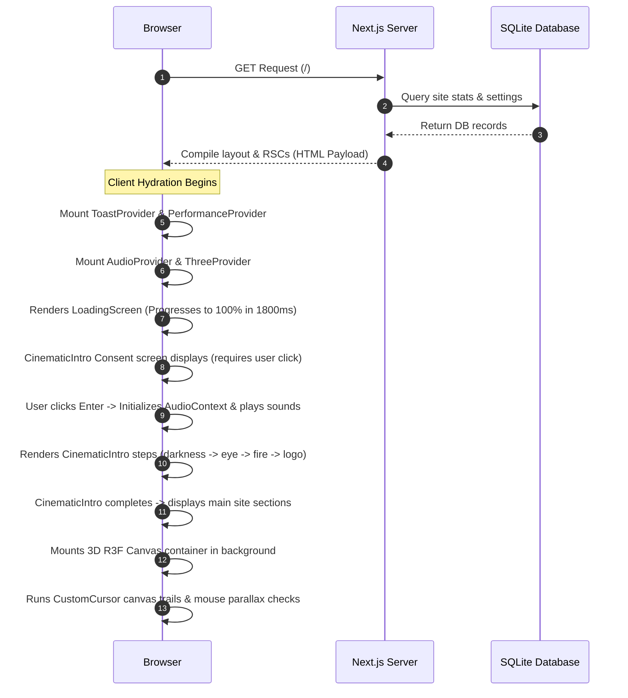

### Provider Flow
Providers are nested in the root [layout.tsx](file:///c:/Users/harsha/Desktop/Dragon_Up/dragon-up/app/layout.tsx#L52-L79):
```
RootLayout
└── ToastProvider (Context)
    └── PerformanceProvider (Zustand syncing)
        └── AudioProvider (Synthesizer context)
            └── AnimationProvider (Scroll boundary context)
                └── ThreeProvider (WebGL context wrapper)
                    ├── Global elements (CustomCursor, LoadingScreen, CinematicIntro)
                    ├── Navbar
                    ├── Children (main content)
                    └── Footer
```

### Dependency Flow
*   **Config constants** ([config/navigation.ts](file:///c:/Users/harsha/Desktop/Dragon_Up/dragon-up/config/navigation.ts)) are imported by layouts to populate navigation items.
*   **Global stores** ([store/performance-store.ts](file:///c:/Users/harsha/Desktop/Dragon_Up/dragon-up/store/performance-store.ts)) are read by components to update rendering quality dynamically.
*   **Form validators** ([lib/validations.ts](file:///c:/Users/harsha/Desktop/Dragon_Up/dragon-up/lib/validations.ts)) are shared between client forms and backend route controllers.

### Folder Hierarchy
```
dragon-up/
├── app/                  # Next.js App Router folders
│   ├── about/            # About page
│   ├── admin/            # Admin auth & dashboard panels
│   ├── api/              # API route controllers
│   ├── community-guidelines/ # Guidelines page
│   ├── contact/          # Contact page
│   ├── privacy-policy/   # Privacy policy page
│   ├── team/             # Roster directory page
│   └── terms/            # Terms of service page
├── components/           # Component libraries
│   ├── admin/            # Dashboard sidebar & widgets
│   ├── animation/        # Cursor trails & intro sequences
│   ├── audio/            # Synthesizers & mute buttons
│   ├── home/             # Landing page sections
│   ├── layout/           # Shared structural sections
│   ├── performance/      # FPS monitor hooks
│   ├── providers/        # Context provider blocks
│   ├── three/            # WebGL meshes & setups
│   └── ui/               # Reusable UI widgets
├── config/               # Central constants
├── data/                 # Local mock datasets
├── hooks/                # Custom utility hooks
├── lib/                  # Database, validations, auth utilities
├── prisma/               # SQLite database, seeding, schema files
├── public/               # Static media assets
└── store/                # Zustand global state files
```

### Component Hierarchy
```
layout.tsx (Root Layout)
├── Providers (Toast -> Performance -> Audio -> Animation -> Three)
├── CinematicIntro (Entrance sequence)
├── CustomCursor (Canvas trails tracker)
├── Navbar (Menu, volume settings, performance sliders)
└── main (Content children)
    └── PageTransition (Motion-fade swiper wrapper)
        └── [Selected Route Components]
```

### Application Lifecycle
1.  **Pre-Mount**: Next.js parses query and serves SSR HTML shell.
2.  **Mount**: Client bundles hydrate. Toast, Audio, and Canvas contexts initialize.
3.  **Preload**: `LoadingScreen` displays for 1800ms.
4.  **Consent**: Intro blocks viewport, requiring user consent to play audio files.
5.  **Cinematic Reveal**: Sequences run in order (Darkness -> Eye -> Fire -> Logo -> Completed).
6.  **Interactive Loop**: Parallax meshes track cursor movement. Scroll checks update active homepage sections.
7.  **Auto-Degradation Loop**: Frame times are monitored. If the frame rate drops below 32 FPS, graphics scale down.
8.  **Exit**: Mutes sound contexts when the browser tab is unfocused. Cleans up frame loops on exit.

---

## SECTION 2: Project Workflow

### Homepage Workflow
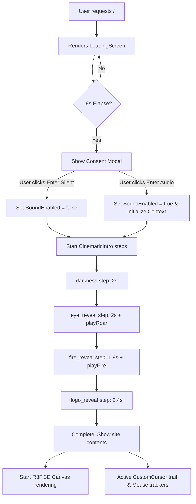

### User Flow
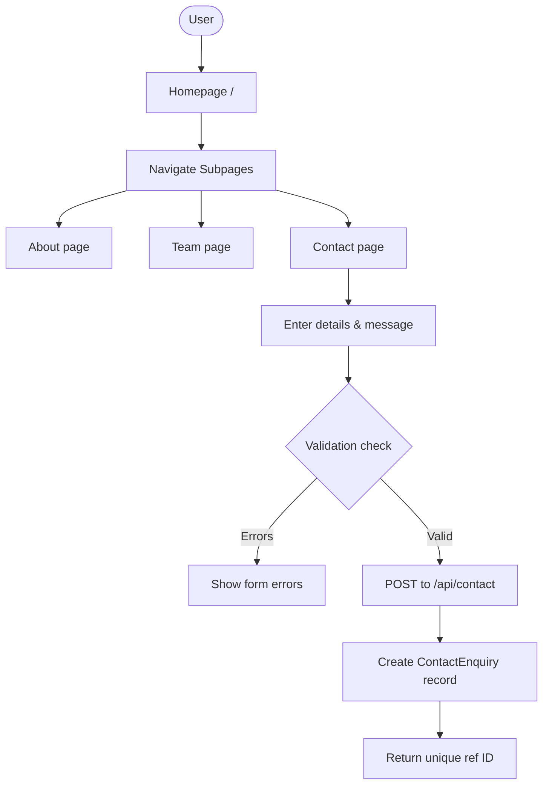

### Admin Flow
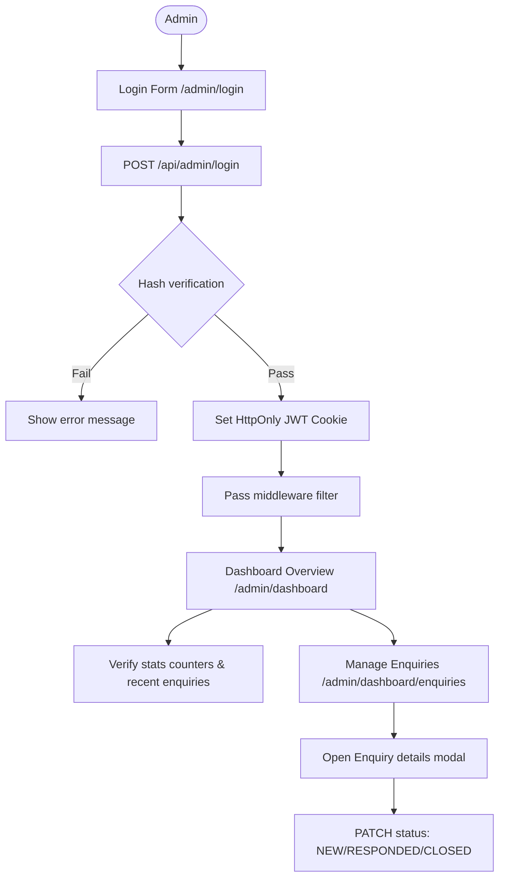

### Authentication Flow
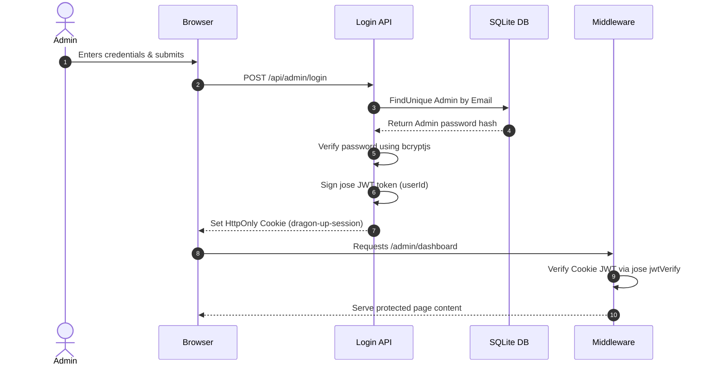

### API Flow
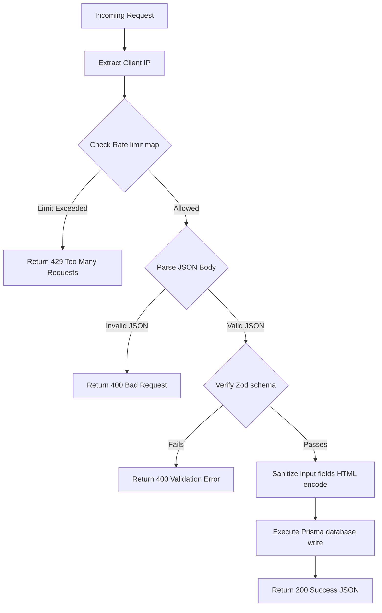

### Database Flow
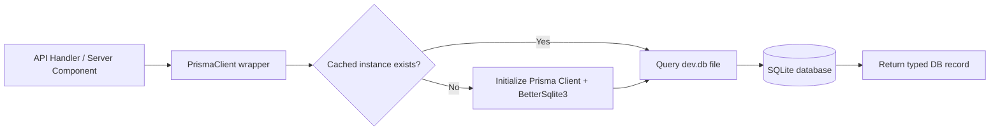

### Rendering Flow
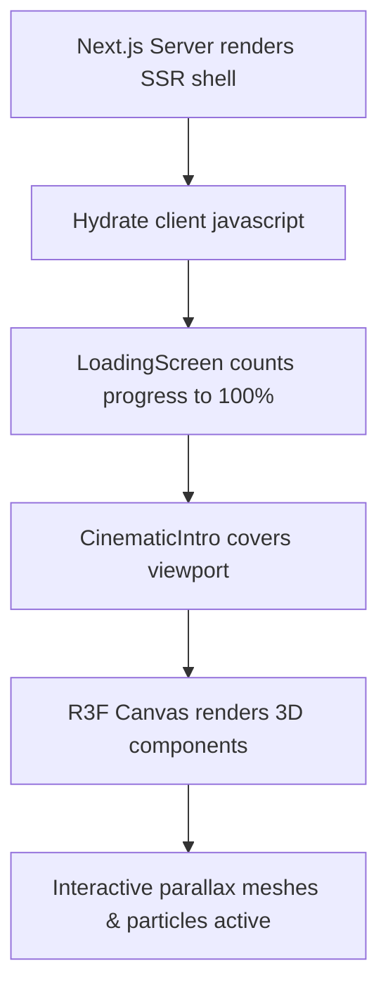

### Animation Flow
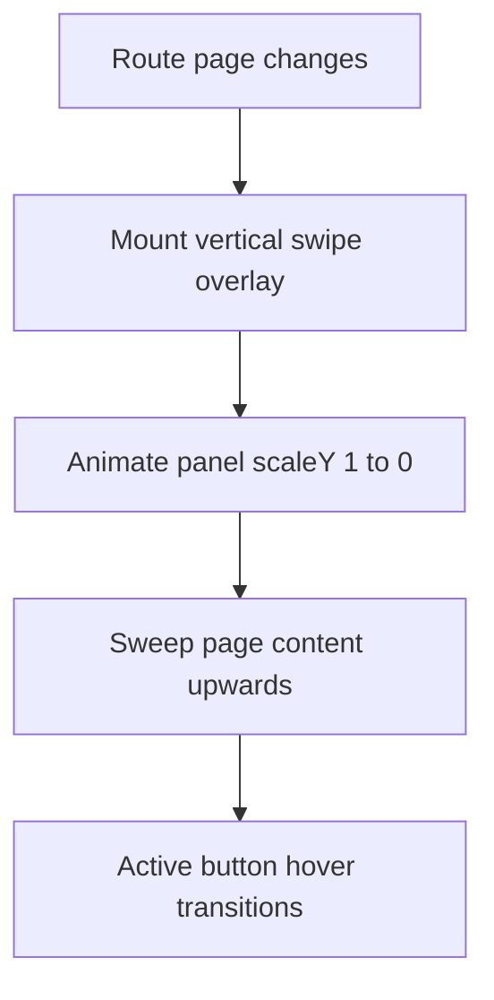

### Three.js Flow
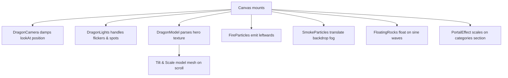

### Audio Flow
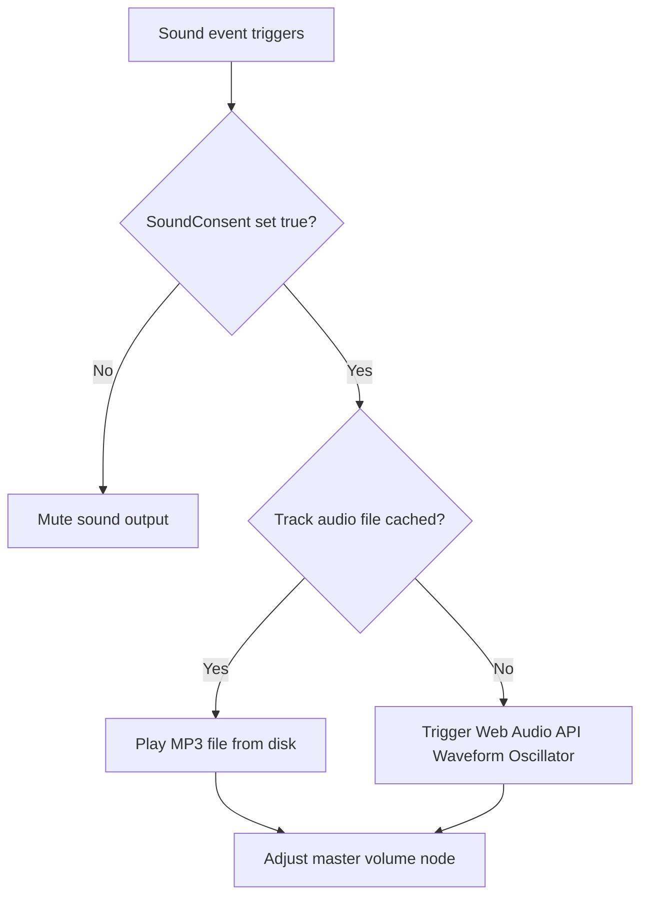

### Performance Flow
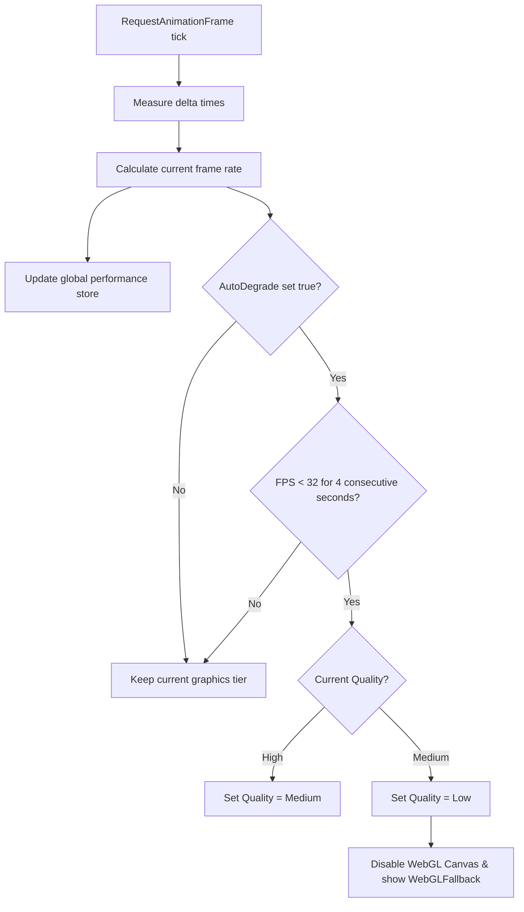

### Loading Flow
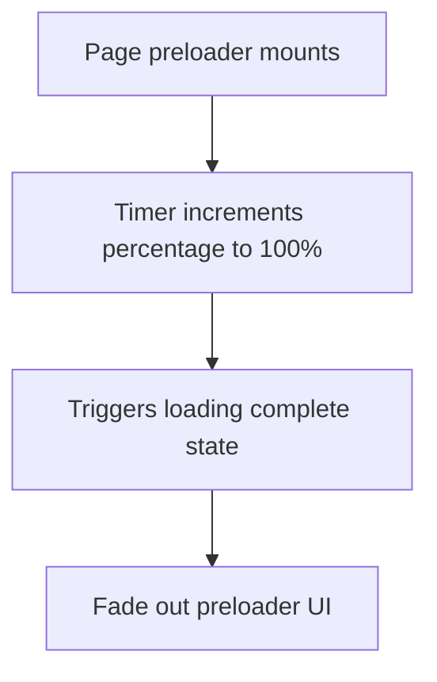

### Navigation Flow
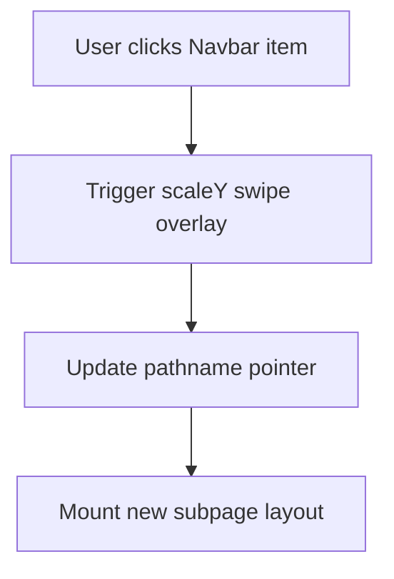

### Error Handling Flow
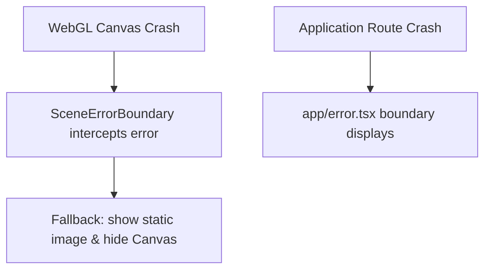

### State Management Flow
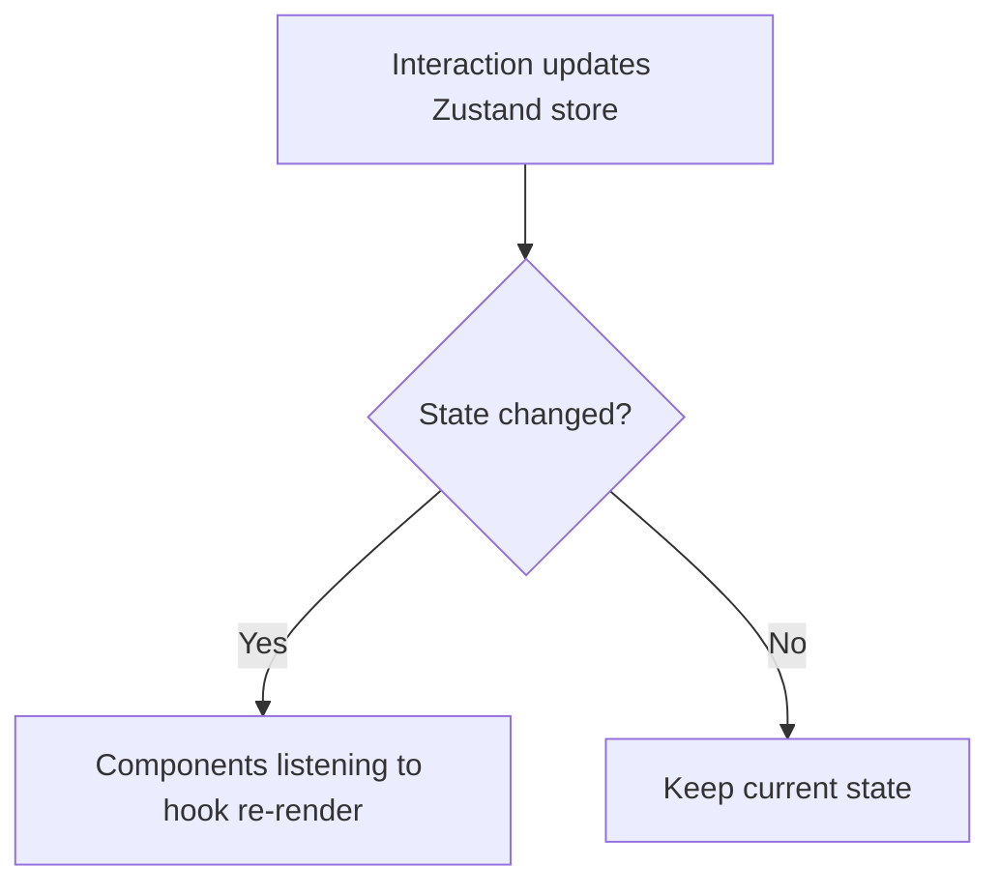

---

## SECTION 3: Folder Audit

### `app/`
*   **Purpose**: Manages sitemaps, robots configurations, page routing layouts, API endpoints, global styles, and route interceptors.
*   **Files**:
    *   `layout.tsx` (Provider configuration wrappers)
    *   `page.tsx` (Homepage loader wrapper)
    *   `globals.css` (Tailwind styles, custom animations, keyframes)
    *   `middleware.ts` (Admin auth routing boundaries)
    *   `robots.ts` (SEO configurations)
    *   `sitemap.ts` (SEO sitemap configurations)
*   **Dependencies**: `next`, `react`, `@tailwindcss/postcss`, `framer-motion`, Zustand stores.
*   **Who Imports It**: Loaded directly by the Next.js framework engine on initialization.
*   **Completion**: **100%**.
*   **Missing Files**: None.
*   **Unused Files**: None.
*   **Dead Code**: None.

### `app/about/`
*   **Purpose**: Renders the history page layout.
*   **Files**: `page.tsx`
*   **Dependencies**: `Navbar`, `Footer`, `PageHero`, `SectionHeading`, `GamingCard`.
*   **Who Imports It**: Next.js App Router maps this path.
*   **Completion**: **100%**.

### `app/admin/dashboard/`
*   **Purpose**: Administrator control panel.
*   **Files**:
    *   `layout.tsx` (Protected layout wrappers)
    *   `page.tsx` (Dashboard overview module)
*   **Dependencies**: `AdminSidebar`, `AdminStatCard`, Prisma Client.
*   **Who Imports It**: Next.js App Router maps this path.
*   **Completion**: **50%** (CMS and settings pages are missing).
*   **Missing Files**:
    *   `app/admin/dashboard/content/page.tsx` (Website content editor)
    *   `app/admin/dashboard/team/page.tsx` (Team roster manager)
    *   `app/admin/dashboard/social/page.tsx` (Social links manager)
    *   `app/admin/dashboard/settings/page.tsx` (Site settings panel)

### `app/admin/dashboard/enquiries/`
*   **Purpose**: Inboxes interface for managing submitted contact enquiries.
*   **Files**: `page.tsx` (Listing interface & status change handlers)
*   **Dependencies**: `AdminSidebar`, `EmptyState`, Zod, React Hook Form.
*   **Who Imports It**: Next.js App Router maps this path.
*   **Completion**: **100%**.

### `app/admin/login/`
*   **Purpose**: Authenticates admin users.
*   **Files**: `page.tsx`
*   **Dependencies**: Zod, React Hook Form.
*   **Who Imports It**: Next.js App Router maps this path.
*   **Completion**: **100%**.

### `app/api/admin/`
*   **Purpose**: Protected backend routes for administration utilities.
*   **Files**:
    *   `enquiries/route.ts` (Lists submitted enquiries)
    *   `enquiries/[id]/route.ts` (Updates enquiry status)
    *   `login/route.ts` (Verifies admin credentials and sets session cookie)
    *   `logout/route.ts` (Clears session cookie)
*   **Dependencies**: Prisma Client, Zod, `jose`, `bcryptjs`.
*   **Who Imports It**: Interfaced via frontend AJAX fetch requests.
*   **Completion**: **100%**.

### `app/api/contact/`
*   **Purpose**: Receives public contact enquiries.
*   **Files**: `route.ts`
*   **Dependencies**: Zod, Prisma Client, rate limiter, input sanitization helpers.
*   **Who Imports It**: Interfaced via the public contact form client.
*   **Completion**: **100%**.

### `app/api/newsletter/`
*   **Purpose**: Receives public newsletter subscription requests.
*   **Files**: `route.ts`
*   **Dependencies**: Zod, Prisma Client, rate limiter.
*   **Who Imports It**: Interfaced via the newsletter subscription widget.
*   **Completion**: **100%**.

### `app/community-guidelines/`
*   **Purpose**: Static community guidelines page.
*   **Files**: `page.tsx`
*   **Dependencies**: `Navbar`, `Footer`, `PageHero`.
*   **Who Imports It**: Next.js App Router maps this path.
*   **Completion**: **100%**.

### `app/contact/`
*   **Purpose**: Renders the contact form page.
*   **Files**:
    *   `page.tsx` (Main layout container)
    *   `ContactForm.tsx` (Validates and submits enquiries form)
*   **Dependencies**: Zod, React Hook Form, `Toast`.
*   **Who Imports It**: Next.js App Router maps this path.
*   **Completion**: **100%**.

### `app/privacy-policy/`
*   **Purpose**: Renders the privacy policy page.
*   **Files**: `page.tsx`
*   **Dependencies**: `Navbar`, `Footer`, `PageHero`.
*   **Who Imports It**: Next.js App Router maps this path.
*   **Completion**: **100%**.

### `app/team/`
*   **Purpose**: Roster display page.
*   **Files**: `page.tsx` (Queries the `TeamMember` database table directly)
*   **Dependencies**: Prisma Client, `Navbar`, `Footer`, `PageHero`.
*   **Who Imports It**: Next.js App Router maps this path.
*   **Completion**: **100%** (Team avatar images are missing).

### `app/terms/`
*   **Purpose**: Renders the terms of service page.
*   **Files**: `page.tsx`
*   **Dependencies**: `Navbar`, `Footer`, `PageHero`.
*   **Who Imports It**: Next.js App Router maps this path.
*   **Completion**: **100%**.

### `components/admin/`
*   **Purpose**: Dashboard layout components.
*   **Files**:
    *   `AdminSidebar.tsx` (Dashboard navigation layout)
    *   `AdminStatCard.tsx` (Renders dashboard statistics metrics)
*   **Dependencies**: `lucide-react`, Tailwind classes.
*   **Who Imports It**: Imported by admin dashboard pages.
*   **Completion**: **100%**.

### `components/animation/`
*   **Purpose**: Web page pre-render animations.
*   **Files**:
    *   `CinematicIntro.tsx` (Entrance loading sequences)
    *   `CursorTrail.tsx` (Canvas trail placeholder)
    *   `CustomCursor.tsx` (Tracks cursor coordinate trail)
*   **Dependencies**: `framer-motion`, Zustand stores.
*   **Who Imports It**: Root layout page wrappers.
*   **Completion**: **100%**.
*   **Unused Files**:
    *   `CursorTrail.tsx` (Returns `null`. Trail calculation logic was moved directly into `CustomCursor.tsx` to optimize performance).

### `components/audio/`
*   **Purpose**: Configures global sound contexts.
*   **Files**:
    *   `AudioControls.tsx` (Renders the volume adjuster widget)
    *   `AudioManager.tsx` (Updates volume and manages background mute settings)
*   **Dependencies**: `lucide-react`, Zustand stores, Web Audio synthetics.
*   **Who Imports It**: Root page containers.
*   **Completion**: **100%**.

### `components/home/`
*   **Purpose**: Homepage section layouts.
*   **Files**:
    *   `HeroSection.tsx` (Displays background video and CTA buttons)
    *   `StatsSection.tsx` (Renders count-up statistics)
    *   `LatestVideoSection.tsx` (Mock video grid)
    *   `GamingCategories.tsx` (Platform showcase cards)
    *   `CommunityPreview.tsx` (Highlights community features)
    *   `WhyDragonUp.tsx` (Benefits listing grid)
    *   `SocialSection.tsx` (Social channel links)
    *   `NewsletterSection.tsx` (Validates and processes subscription requests)
    *   `CTASection.tsx` (Footer call-to-action block)
*   **Dependencies**: `framer-motion`, UI elements, Zustand stores.
*   **Who Imports It**: Homepage container (`app/page.tsx`).
*   **Completion**: **100%**.

### `components/layout/`
*   **Purpose**: Shared structural layout templates.
*   **Files**:
    *   `Footer.tsx` (Footer links layout)
    *   `Navbar.tsx` (Main navigation header)
    *   `LoadingScreen.tsx` (Initial preloader screen)
    *   `PageContainer.tsx` (Width wrapper template)
    *   `PageTransition.tsx` (Scale animations between pages)
*   **Dependencies**: `framer-motion`, `lucide-react`, Zustand stores.
*   **Who Imports It**: Layout loaders and user-facing page components.
*   **Completion**: **100%**.
*   **Unused Files**:
    *   `PageContainer.tsx` (Unused in user subpage directories).

### `components/performance/`
*   **Purpose**: Dynamic performance scaling loops.
*   **Files**: `PerformanceManager.tsx` (Monitors frames and adjusts graphics quality)
*   **Dependencies**: Zustand stores.
*   **Who Imports It**: Root layouts.
*   **Completion**: **100%**.

### `components/providers/`
*   **Purpose**: Global state contexts.
*   **Files**:
    *   `AnimationProvider.tsx` (Scroll progression context)
    *   `AudioProvider.tsx` (Synthesizer context wrapper)
    *   `PerformanceProvider.tsx` (Hardware settings initializer context)
    *   `ThreeProvider.tsx` (3D Canvas context wrapper)
*   **Dependencies**: React, stores.
*   **Who Imports It**: Root layout page loaders.
*   **Completion**: **100%**.

### `components/three/`
*   **Purpose**: Renders WebGL entities.
*   **Files**:
    *   `DragonScene.tsx` (3D Canvas viewport controller)
    *   `DragonCamera.tsx` (Calculates lookAt vectors)
    *   `DragonLights.tsx` (Configures lights and lightning flashes)
    *   `DragonModel.tsx` (Parallax texture mesh)
    *   `FireParticles.tsx` (Emerald embers emitter)
    *   `FloatingParticles.tsx` (Drifts backdrop dust particles)
    *   `SmokeParticles.tsx` (Backdrop fog generator)
    *   `PortalEffect.tsx` (Swirling categories portal)
    *   `FloatingRocks.tsx` (Floating dodecahedrons mesh)
    *   `SceneLoader.tsx` (Mesh load percentage bar)
    *   `SceneErrorBoundary.tsx` (Canvas crash fallback boundary)
    *   `WebGLFallback.tsx` (Static placeholder image backup)
*   **Dependencies**: `three`, `@react-three/fiber`, `@react-three/drei`.
*   **Who Imports It**: Hydrated ThreeProvider context wrapper.
*   **Completion**: **100%**.

### `components/ui/`
*   **Purpose**: Reusable interface widgets.
*   **Files**: Includes buttons, badges, toast contexts, loaders, modals, textareas, inputs.
*   **Dependencies**: `framer-motion`, `lucide-react`, Tailwind classes.
*   **Who Imports It**: Layout components, API handlers, page forms.
*   **Completion**: **100%**.

### `config/`
*   **Purpose**: Global settings constants.
*   **Files**:
    *   `navigation.ts` (Menu configuration items)
    *   `site.ts` (SEO configurations)
    *   `social-links.ts` (External profile URLs)
*   **Dependencies**: Types configurations.
*   **Who Imports It**: Navbars, footers, API wrappers, SEO metadata tags.
*   **Completion**: **100%**.

### `data/`
*   **Purpose**: Renders static text listings.
*   **Files**:
    *   `faq.ts` (FAQ listings data)
    *   `featured-content.ts` (Mock lists, categories metadata)
    *   `team.ts` (Roster mock fallbacks)
*   **Dependencies**: Types definitions.
*   **Who Imports It**: About page, team page, homepage content structures.
*   **Completion**: **100%**.

### `hooks/`
*   **Purpose**: Encapsulates reactive system components.
*   **Files**:
    *   `useDeviceCapability.ts` (Analyzes GPU parameters)
    *   `useMousePosition.ts` (Cursor positioning)
    *   `useReducedMotion.ts` (Disables animations based on OS settings)
    *   `useScrollProgress.ts` (Scroll offsets check)
    *   `useSound.ts` (Triggers sound effects)
    *   `useWebGLSupport.ts` (Checks WebGL capabilities)
*   **Dependencies**: Zustand stores.
*   **Who Imports It**: R3F meshes, customized cursors, buttons, page loader loops.
*   **Completion**: **100%**.

### `lib/`
*   **Purpose**: Validations, authentication hooks, and database clients.
*   **Files**:
    *   `audio-config.ts` (Audio synthesizer engine)
    *   `auth.ts` (Admin auth helpers)
    *   `db.ts` (Prisma SQLite client pool)
    *   `utils.ts` (Sanitization and rate limiters)
    *   `validations.ts` (Zod schemas validation library)
*   **Dependencies**: `jose`, `bcryptjs`, `@prisma/client`, `zod`, `better-sqlite3`.
*   **Who Imports It**: API routers, form pages, dashboard overview layouts.
*   **Completion**: **100%**.

### `prisma/`
*   **Purpose**: Database configuration.
*   **Files**:
    *   `schema.prisma` (Declares tables structure)
    *   `seed.ts` (Populates local testing data)
    *   `dev.db` (SQLite binary file)
*   **Dependencies**: Prisma generators.
*   **Who Imports It**: DB client pool wrapper (`lib/db.ts`).
*   **Completion**: **100%**.

### `public/`
*   **Purpose**: Static files and media assets.
*   **Files**:
    *   `/images/hero-bg.png`
    *   `/images/dragon-up-og.jpg`
    *   `/images/categories/`
    *   `/images/videos/dragon_up_bg.mp4`
    *   `/logos/` (Empty directory)
    *   `/images/team/` (Empty directory)
*   **Dependencies**: None.
*   **Who Imports It**: Referenced via URL path strings.
*   **Completion**: **50%** (Audio files, team avatars, and logos are missing).
*   **Missing Files**:
    *   `public/audio/*.mp3` (Missing folder).
    *   `public/images/team/*.png` (Missing assets).
    *   `public/logos/*.png` (Missing assets).

### `store/`
*   **Purpose**: Global state management.
*   **Files**:
    *   `animation-store.ts` (Timeline transitions)
    *   `audio-store.ts` (Audio levels)
    *   `performance-store.ts` (Quality settings)
*   **Dependencies**: `zustand`.
*   **Who Imports It**: Providers, UI elements, canvas models.
*   **Completion**: **100%**.

### `types/`
*   **Purpose**: Static Type contracts.
*   **Files**:
    *   `index.ts`
*   **Dependencies**: None.
*   **Who Imports It**: Config files, data parameters, components.
*   **Completion**: **100%**.

---

## SECTION 4: Component Tree

This section lists the component tree for each route:

### 1. Route: `/` (Home)
```
RootLayout [app/layout.tsx]
└── ToastProvider [components/ui/Toast.tsx]
    └── PerformanceProvider [components/providers/PerformanceProvider.tsx]
        ├── PerformanceManager [components/performance/PerformanceManager.tsx]
        └── AudioProvider [components/providers/AudioProvider.tsx]
            ├── AudioManager [components/audio/AudioManager.tsx]
            └── AnimationProvider [components/providers/AnimationProvider.tsx]
                └── ThreeProvider [components/providers/ThreeProvider.tsx]
                    ├── CustomCursor [components/animation/CustomCursor.tsx]
                    ├── LoadingScreen [components/layout/LoadingScreen.tsx]
                    ├── CinematicIntro [components/animation/CinematicIntro.tsx]
                    │   └── IntroSkipButton [components/ui/IntroSkipButton.tsx]
                    ├── Navbar [components/layout/Navbar.tsx]
                    │   ├── SoundToggle [components/ui/SoundToggle.tsx]
                    │   ├── PerformanceToggle [components/ui/PerformanceToggle.tsx]
                    │   └── GraphicsSettings [components/ui/GraphicsSettings.tsx]
                    ├── main id="main-content"
                    │   └── PageTransition [components/layout/PageTransition.tsx]
                    │       ├── HeroSection [components/home/HeroSection.tsx]
                    │       │   ├── Badge [components/ui/Badge.tsx]
                    │       │   ├── Button [components/ui/Button.tsx]
                    │       │   └── Modal [components/ui/Modal.tsx]
                    │       ├── StatsSection [components/home/StatsSection.tsx]
                    │       ├── LatestVideoSection [components/home/LatestVideoSection.tsx]
                    │       │   ├── SectionHeading [components/ui/SectionHeading.tsx]
                    │       │   ├── Badge [components/ui/Badge.tsx]
                    │       │   └── Button [components/ui/Button.tsx]
                    │       ├── GamingCategories [components/home/GamingCategories.tsx]
                    │       │   ├── SectionHeading [components/ui/SectionHeading.tsx]
                    │       │   └── Button [components/ui/Button.tsx]
                    │       ├── CommunityPreview [components/home/CommunityPreview.tsx]
                    │       │   ├── SectionHeading [components/ui/SectionHeading.tsx]
                    │       │   ├── Button [components/ui/Button.tsx]
                    │       │   └── Modal [components/ui/Modal.tsx]
                    │       ├── WhyDragonUp [components/home/WhyDragonUp.tsx]
                    │       │   └── SectionHeading [components/ui/SectionHeading.tsx]
                    │       ├── SocialSection [components/home/SocialSection.tsx]
                    │       │   ├── SectionHeading [components/ui/SectionHeading.tsx]
                    │       │   └── Button [components/ui/Button.tsx]
                    │       ├── NewsletterSection [components/home/NewsletterSection.tsx]
                    │       │   ├── Input [components/ui/Input.tsx]
                    │       │   └── Button [components/ui/Button.tsx]
                    │       └── CTASection [components/home/CTASection.tsx]
                    │           └── Button [components/ui/Button.tsx]
                    ├── Footer [components/layout/Footer.tsx]
                    └── DragonScene [components/three/DragonScene.tsx]
                        ├── SceneErrorBoundary [components/three/SceneErrorBoundary.tsx]
                        │   ├── Canvas
                        │   │   ├── DragonCamera [components/three/DragonCamera.tsx]
                        │   │   ├── DragonLights [components/three/DragonLights.tsx]
                        │   │   ├── DragonModel [components/three/DragonModel.tsx]
                        │   │   ├── FireParticles [components/three/FireParticles.tsx]
                        │   │   ├── FloatingParticles [components/three/FloatingParticles.tsx]
                        │   │   ├── SmokeParticles [components/three/SmokeParticles.tsx]
                        │   │   ├── PortalEffect [components/three/PortalEffect.tsx]
                        │   │   └── FloatingRocks [components/three/FloatingRocks.tsx]
                        │   └── SceneLoader [components/three/SceneLoader.tsx]
                        └── WebGLFallback [components/three/WebGLFallback.tsx]
```

### 2. Routes: `/about`, `/team`, `/contact`, `/privacy-policy`, `/terms`, `/community-guidelines`
```
RootLayout
└── ToastProvider
    └── PerformanceProvider
        └── AudioProvider
            └── AnimationProvider
                └── ThreeProvider
                    ├── CustomCursor
                    ├── LoadingScreen
                    ├── Navbar
                    ├── main id="main-content"
                    │   └── PageTransition
                    │       └── [Selected Subpage Content]
                    │           ├── PageHero [components/ui/PageHero.tsx]
                    │           └── [Subpage specific form / text grids]
                    │               └── (e.g. ContactForm [app/contact/ContactForm.tsx])
                    │                   ├── Input [components/ui/Input.tsx]
                    │                   ├── Select [components/ui/Select.tsx]
                    │                   ├── Textarea [components/ui/Textarea.tsx]
                    │                   └── Button [components/ui/Button.tsx]
                    ├── Footer
                    └── DragonScene
```

### 3. Route: `/admin/login`
```
RootLayout
└── ToastProvider
    └── AdminLoginPage [app/admin/login/page.tsx]
        └── Form Container
            ├── Input (Email)
            ├── Input (Password)
            └── Button (Submit)
```

### 4. Route: `/admin/dashboard`
```
AdminLayout [app/admin/dashboard/layout.tsx]
├── AdminSidebar [components/admin/AdminSidebar.tsx]
│   └── Navigation Items & Logout Button
└── main
    └── AdminDashboardPage [app/admin/dashboard/page.tsx]
        └── AdminStatCard Grid [components/admin/AdminStatCard.tsx]
```

### 5. Route: `/admin/dashboard/enquiries`
```
AdminLayout [app/admin/dashboard/layout.tsx]
├── AdminSidebar [components/admin/AdminSidebar.tsx]
└── main
    └── AdminEnquiriesPage [app/admin/dashboard/enquiries/page.tsx]
        ├── Input (Search field)
        ├── Select (Filter field)
        ├── EmptyState [components/ui/EmptyState.tsx]
        ├── Status update interactive tables
        └── Modal [components/ui/Modal.tsx] (Details view overlay)
```

---

## SECTION 5: Route Tree

### 1. `/` (Landing Page)
*   **Purpose**: The main homepage. Features a video background, statistical callouts, gameplay showcases, and social connection cards.
*   **Components**: Core landing sections, custom cursors, preloader screens, and WebGL elements.
*   **APIs Used**: `/api/newsletter` (POST subscription queries).
*   **Database**: Queries site settings and counters to display totals.
*   **State**: Updates page loading metrics and mouse coordinates.
*   **Loading**: Preloads visual assets, showing progress on `LoadingScreen`.
*   **Animations**: Renders entrance slides and parallax calculations on mouse move.
*   **Errors**: Caught by `SceneErrorBoundary` (Canvas level) and `app/error.tsx` (Route level).
*   **Missing Logic**: Join buttons trigger static mockup modal alerts rather than starting authentication flows.

### 2. `/about`
*   **Purpose**: Renders the group milestone timeline and FAQ accordion items.
*   **Components**: `PageHero`, list grids, accordion headers.
*   **APIs Used**: None.
*   **Database**: None. Reads mock arrays from [faq.ts](file:///c:/Users/harsha/Desktop/Dragon_Up/dragon-up/data/faq.ts).
*   **State**: Tracks active accordion choices using local React states.
*   **Animations**: Renders standard page transition fades.
*   **Missing Logic**: None.

### 3. `/team`
*   **Purpose**: Renders the roster catalog cards.
*   **Components**: `PageHero`, profile details blocks.
*   **APIs Used**: None.
*   **Database**: Queries the database to list all records from the `TeamMember` table.
*   **State**: React server component reads database directly.
*   **Animations**: Renders standard page transition fades.
*   **Missing Logic**: **Partial**. Static avatars are missing from the folder, causing the browser to render placeholder layouts.

### 4. `/contact`
*   **Purpose**: Renders the enquiry submission form.
*   **Components**: `PageHero`, `ContactForm`.
*   **APIs Used**: `/api/contact` (POST form submissions).
*   **Database**: Inserts record into `ContactEnquiry` table.
*   **State**: Handles form validation states using local state variables.
*   **Animations**: React Toast notification slides in on success.
*   **Missing Logic**: None.

### 5. `/admin/login`
*   **Purpose**: Authenticates administrative dashboard sessions.
*   **Components**: Login form blocks.
*   **APIs Used**: `/api/admin/login` (POST credential checks).
*   **Database**: Queries `Admin` profile by email.
*   **State**: Tracks remember toggles and validation statuses.
*   **Animations**: Standard panel transitions.
*   **Missing Logic**: None.

### 6. `/admin/dashboard`
*   **Purpose**: Administration overview analytics dashboard.
*   **Components**: `AdminSidebar`, `AdminStatCard` grid.
*   **APIs Used**: None. Reads database metrics directly.
*   **Database**: Queries totals from `ContactEnquiry` and `TeamMember` tables.
*   **State**: Server component mounts data.
*   **Animations**: Sidebar transition fades.
*   **Missing Logic**: website content edits, social link updates, and site settings toggles are not implemented.

### 7. `/admin/dashboard/enquiries`
*   **Purpose**: List, filter, search, and update the status of contact enquiries.
*   **Components**: `AdminSidebar`, search bars, status modals.
*   **APIs Used**: `/api/admin/enquiries` (GET), `/api/admin/enquiries/[id]` (PATCH status updates).
*   **Database**: Reads and updates `ContactEnquiry` records.
*   **State**: Tracks active search queries, selected statuses, and pagination filters.
*   **Animations**: Details modal slides in from the side.
*   **Missing Logic**: None.

---

## SECTION 6: State Flow

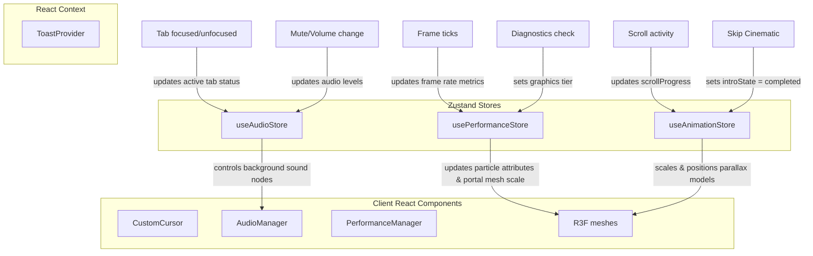

### State Storage Details

#### Zustand
*   **Timeline Tracker** ([store/animation-store.ts](file:///c:/Users/harsha/Desktop/Dragon_Up/dragon-up/store/animation-store.ts)): Renders intro stages (`darkness`, `eye_reveal`, `fire_reveal`, `logo_reveal`, `completed`) and updates scroll offsets dynamically.
*   **Audio Store** ([store/audio-store.ts](file:///c:/Users/harsha/Desktop/Dragon_Up/dragon-up/store/audio-store.ts)): Synchronizes user settings (master volumes, mute triggers, audio consent).
*   **Performance Store** ([store/performance-store.ts](file:///c:/Users/harsha/Desktop/Dragon_Up/dragon-up/store/performance-store.ts)): Sets graphics capability tiers (`high`, `medium`, `low`) and monitors FPS.

#### Context
*   **Toast Alert System** ([components/ui/Toast.tsx](file:///c:/Users/harsha/Desktop/Dragon_Up/dragon-up/components/ui/Toast.tsx)): Mounts alert containers at the layout level. Alerts can be triggered globally using the custom hook:
    ```typescript
    const { showToast } = useToast();
    ```

#### Local React State
*   Used for form validation states (React Hook Form) and pagination filters (admin dashboard lists).

#### Data Propagation & Movement
*   **Client to Server**: Submit buttons trigger HTTP POST queries to routes inside `app/api/`.
*   **Server to Client**: Next.js Server Components query Prisma SQLite databases directly. Data is passed down to client widgets as read-only properties, keeping connection details secure.

---

## SECTION 7: Authentication Flow

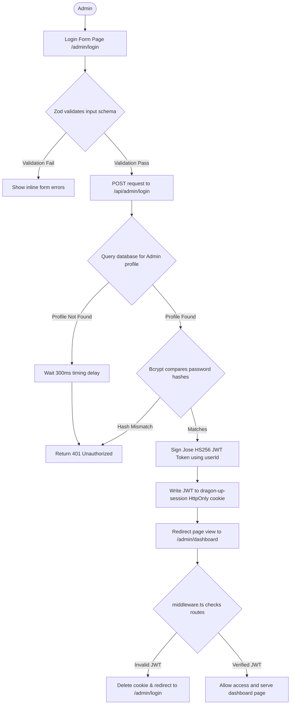

### Detailed Breakdown of Execution Steps

#### 1. Input Validation
Client form parses fields against [loginFormSchema](file:///c:/Users/harsha/Desktop/Dragon_Up/dragon-up/lib/validations.ts#L35-L42) using Zod. The email field must be a valid email format, and the password must be between 6 and 128 characters.

#### 2. Backend Lookup
The API checks for matching administrator accounts in [login/route.ts](file:///c:/Users/harsha/Desktop/Dragon_Up/dragon-up/app/api/admin/login/route.ts#L20):
```typescript
const admin = await db.admin.findUnique({ where: { email } });
```
If the admin user does not exist, a delay is added to prevent timing attacks:
```typescript
await new Promise((r) => setTimeout(r, 300));
```

#### 3. Verification & Token Generation
If the admin is found, [verifyPassword](file:///c:/Users/harsha/Desktop/Dragon_Up/dragon-up/lib/auth.ts#L18) compares the password with the stored hash using `bcryptjs`.
On validation success, `jose` creates a signed JWT session cookie:
```typescript
await createSession(admin.id);
```
This writes the JWT payload to `dragon-up-session` with Lax SameSite protection, set to expire in 24 hours.

#### 4. Route Interceptors
The application checks request routes in [middleware.ts](file:///c:/Users/harsha/Desktop/Dragon_Up/dragon-up/middleware.ts#L12-L25):
```typescript
const token = req.cookies.get("dragon-up-session")?.value;
if (!token) return NextResponse.redirect(new URL("/admin/login", req.url));
await jwtVerify(token, SECRET);
```
If token verification fails, the cookie is deleted and the user is redirected to the login page.

---

## SECTION 8: Database

### Schema Tables & Fields (from `prisma/schema.prisma`)

```
Admin {
  id           String   (Primary Key, cuid)
  email        String   (Unique Index)
  passwordHash String
  createdAt    DateTime (default now)
  updatedAt    DateTime (auto update)
}

ContactEnquiry {
  id        String   (Primary Key, cuid)
  name      String
  email     String
  type      String
  subject   String
  message   String
  status    String   (default "NEW")
  reference String   (Unique Index)
  createdAt DateTime (default now)
  updatedAt DateTime (auto update)
}

TeamMember {
  id           String   (Primary Key, cuid)
  name         String
  role         String
  bio          String
  image        String?
  favoriteGame String?
  socialLink   String?
  displayOrder Int      (default 0)
  isActive     Boolean  (default true)
  createdAt    DateTime (default now)
  updatedAt    DateTime (auto update)
}

SiteSetting {
  id        String   (Primary Key, cuid)
  key       String   (Unique Index)
  value     String
  createdAt DateTime (default now)
  updatedAt DateTime (auto update)
}

NewsletterSubscriber {
  id        String   (Primary Key, cuid)
  email     String   (Unique Index)
  createdAt DateTime (default now)
}
```

### Table Relations
*   **None**. There are **no foreign key relationships** or references defined in the schema.

### Indexes
*   Unique indexes are created on email, reference, and key fields:
    *   `Admin.email`
    *   `ContactEnquiry.reference`
    *   `SiteSetting.key`
    *   `NewsletterSubscriber.email`

### Database Queries

#### 1. Form Submissions
Saves contact form submissions to the database:
```typescript
await db.contactEnquiry.create({
  data: { name, email, type, subject, message, status: "NEW", reference }
});
```

#### 2. Newsletter Registration
Subscribes users to the newsletter:
```typescript
await db.newsletterSubscriber.upsert({
  where: { email },
  update: {},
  create: { email }
});
```

#### 3. Listing Enquiries (Admin Dashboard)
Queries contact form submissions:
```typescript
await db.contactEnquiry.findMany({
  orderBy: { createdAt: "desc" },
  take: 50
});
```

#### 4. Updating Enquiry Status
Updates the status of an enquiry:
```typescript
await db.contactEnquiry.update({
  where: { id },
  data: { status }
});
```

---

## SECTION 9: API Audit

### 1. `POST /api/newsletter`
*   **Method**: `POST`
*   **Validation**: Validates that email formats match Zod definitions.
*   **Security**: Rate limiting: 3 requests per 60 seconds per client IP.
*   **Authentication**: None.
*   **Database**: Inserts record into `NewsletterSubscriber` table.
*   **Error Handling**: Returns `400` for validation issues, `429` for rate limits, and `500` for database errors.
*   **Status**: Fully Functional.
*   **Dependencies**: Prisma database wrapper (`lib/db.ts`).

### 2. `POST /api/contact`
*   **Method**: `POST`
*   **Validation**: Validates form inputs against Zod schema rules.
*   **Security**: Rate limiting: 5 requests per 60 seconds. Sanitizes input text values to prevent XSS.
*   **Authentication**: None.
*   **Database**: Inserts record into `ContactEnquiry` table.
*   **Error Handling**: Returns `400` for validation issues, `429` for rate limits, and `500` for database errors.
*   **Status**: Fully Functional.
*   **Dependencies**: Prisma database wrapper (`lib/db.ts`).

### 3. `POST /api/admin/login`
*   **Method**: `POST`
*   **Validation**: Checks input credentials format.
*   **Security**: Wait time delay of `300ms` for missing account profiles to prevent user enumeration.
*   **Authentication**: None.
*   **Database**: Queries matching emails. On success, writes a signed session cookie.
*   **Error Handling**: Returns `401` for validation errors, `401` for invalid passwords, and `500` for server issues.
*   **Status**: Fully Functional.
*   **Dependencies**: `bcryptjs`, `jose` JWT cookies.

### 4. `POST /api/admin/logout`
*   **Method**: `POST`
*   **Validation**: None.
*   **Security**: Checks session validation details.
*   **Authentication**: Requires valid admin session.
*   **Database**: None. Clears the session cookie.
*   **Error Handling**: Returns `401` if unauthorized.
*   **Status**: Fully Functional.
*   **Dependencies**: `jose` cookie modifiers.

### 5. `GET /api/admin/enquiries`
*   **Method**: `GET`
*   **Validation**: None.
*   **Security**: Checks session validation details.
*   **Authentication**: Requires valid admin session.
*   **Database**: Queries the top 50 records from `ContactEnquiry`, ordered by date.
*   **Error Handling**: Returns `401` if unauthorized and `500` for database errors.
*   **Status**: Fully Functional.
*   **Dependencies**: Prisma client query wrappers.

### 6. `PATCH /api/admin/enquiries/[id]`
*   **Method**: `PATCH`
*   **Validation**: Validates that status updates are one of `NEW`, `RESPONDED`, or `CLOSED`.
*   **Security**: Checks session validation details.
*   **Authentication**: Requires valid admin session.
*   **Database**: Updates the status field of the specified enquiry in the `ContactEnquiry` table.
*   **Error Handling**: Returns `400` for invalid parameters, `401` if unauthorized, and `500` for database errors.
*   **Status**: Fully Functional.
*   **Dependencies**: Prisma client query wrappers.

---

## SECTION 10: Animation Audit

### Framer Motion
*   **Page Transitions**: [PageTransition.tsx](file:///c:/Users/harsha/Desktop/Dragon_Up/dragon-up/components/layout/PageTransition.tsx#L29-L49) triggers a screen-height background swipe on page change.
*   **Intro Animations**: [CinematicIntro.tsx](file:///c:/Users/harsha/Desktop/Dragon_Up/dragon-up/components/animation/CinematicIntro.tsx) animates sequence steps. If the cinematic state is set to complete, page components fade into view:
    ```typescript
    initial={{ opacity: 0 }} animate={{ opacity: 1 }} transition={{ duration: 1 }}
    ```
*   **Page Preloader**: [LoadingScreen.tsx](file:///c:/Users/harsha/Desktop/Dragon_Up/dragon-up/components/layout/LoadingScreen.tsx) animates the initial progress bar.

### Three.js & R3F
*   **Parallax Model Tilt**: [DragonModel.tsx](file:///c:/Users/harsha/Desktop/Dragon_Up/dragon-up/components/three/DragonModel.tsx#L22-L86) translates and tilts a textured plane mesh on mouse hover.
*   **Fire Particles**: [FireParticles.tsx](file:///c:/Users/harsha/Desktop/Dragon_Up/dragon-up/components/three/FireParticles.tsx#L70-L109) emits green points:
    ```typescript
    posAttr.setXYZ(i, px, py, pz); // updates coordinates on frame tick
    ```
*   **Ambient Dust**: [FloatingParticles.tsx](file:///c:/Users/harsha/Desktop/Dragon_Up/dragon-up/components/three/FloatingParticles.tsx#L35-L57) drifts background points upwards.
*   **Smoke Fog**: [SmokeParticles.tsx](file:///c:/Users/harsha/Desktop/Dragon_Up/dragon-up/components/three/SmokeParticles.tsx#L56-L79) rotates and scales plane meshes displaying procedural canvas textures.
*   **Portal Swirl**: [PortalEffect.tsx](file:///c:/Users/harsha/Desktop/Dragon_Up/dragon-up/components/three/PortalEffect.tsx#L36-L77) scales and rotates a torus ring mesh, dynamically updating coordinate points to orbit the ring when `activeSection === "categories"`.
*   **Floating Rocks**: [FloatingRocks.tsx](file:///c:/Users/harsha/Desktop/Dragon_Up/dragon-up/components/three/FloatingRocks.tsx#L36-L52) floats dodecahedron geometries using a sine wave offset.
*   **Dynamic Spotlights**: [DragonLights.tsx](file:///c:/Users/harsha/Desktop/Dragon_Up/dragon-up/components/three/DragonLights.tsx#L14-L38) generates randomized lightning flashes, decaying the spotlight intensity exponentially over time:
    ```typescript
    lightningLightRef.current.intensity = flashProgress.current * 4.0 * flicker;
    ```
*   **Custom Cursor Trail**: [CustomCursor.tsx](file:///c:/Users/harsha/Desktop/Dragon_Up/dragon-up/components/animation/CustomCursor.tsx#L76-L109) renders a cursor trail by drawing quadratic bezier curves onto a fullscreen 2D canvas on every frame tick.

---

## SECTION 11: Performance Audit

*   **Heuristic Capability Tiering**: [useDeviceCapability.ts](file:///c:/Users/harsha/Desktop/Dragon_Up/dragon-up/hooks/useDeviceCapability.ts) checks hardware specifications on initialization. Mobile devices default to `"low"` quality. Devices with $<4$ CPU cores or $<4$ GB RAM default to `"medium"`. High-end desktop environments default to `"high"`.
*   **Automated Quality Degradation**: [PerformanceManager.tsx](file:///c:/Users/harsha/Desktop/Dragon_Up/dragon-up/components/performance/PerformanceManager.tsx) checks performance rendering times. If frame rates drop below 32 FPS for 4 consecutive seconds, it decreases the quality level in the store.
*   **WebGL Fallbacks**: If the performance level is `"low"`, WebGL is bypassed and [WebGLFallback.tsx](file:///c:/Users/harsha/Desktop/Dragon_Up/dragon-up/components/three/WebGLFallback.tsx) renders a static 2D image.
*   **Dynamic Imports**: `bcryptjs` is imported dynamically inside password encryption and verification logic to reduce server bundle sizes:
    ```typescript
    const bcrypt = await import("bcryptjs");
    ```

---

## SECTION 12: Asset Audit

### Audited Asset Inventory

#### Video Assets
*   `public/images/videos/dragon_up_bg.mp4` — **Implemented** (2.57 MB). Background video for the hero section.

#### Image Assets
*   `public/images/hero-bg.png` — **Implemented** (776 KB). Main background image.
*   `public/images/dragon-up-og.jpg` — **Implemented** (553 KB). OpenGraph social meta image.
*   `public/images/categories/free-fire.png` — **Implemented** (814 KB). Category showcase image.
*   `public/images/categories/pc-gaming.png` — **Implemented** (776 KB). Category showcase image.
*   `public/images/team/founder.png` — **NOT IMPLEMENTED** (missing asset).
*   `public/images/team/content-manager.png` — **NOT IMPLEMENTED** (missing asset).
*   `public/images/team/video-editor.png` — **NOT IMPLEMENTED** (missing asset).
*   `public/images/team/community-manager.png` — **NOT IMPLEMENTED** (missing asset).
*   `public/images/team/stream-mod.png` — **NOT IMPLEMENTED** (missing asset).
*   `public/images/team/tournament-manager.png` — **NOT IMPLEMENTED** (missing asset).

#### Audio Assets
*   `public/audio/ambient-loop.mp3` — **NOT IMPLEMENTED** (missing asset).
*   `public/audio/dragon-roar.mp3` — **NOT IMPLEMENTED** (missing asset).
*   `public/audio/fire-whoosh.mp3` — **NOT IMPLEMENTED** (missing asset).
*   `public/audio/click.mp3` — **NOT IMPLEMENTED** (missing asset).
*   `public/audio/hover.mp3` — **NOT IMPLEMENTED** (missing asset).

#### Font Assets
*   *Inter* (Body font) — Loaded dynamically from Google Fonts in [globals.css](file:///c:/Users/harsha/Desktop/Dragon_Up/dragon-up/app/globals.css#L1).
*   *Orbitron* (Heading font) — Loaded dynamically from Google Fonts in [globals.css](file:///c:/Users/harsha/Desktop/Dragon_Up/dragon-up/app/globals.css#L1).

---

## SECTION 13: Dependency Graph

### Component Dependencies
```
[User Page Routes] 
  ├── [HeroSection, StatsSection, LatestVideoSection...]
  │     ├── [Badge, Button, Modal, Input...] (UI System Components)
  │     └── [Zustand Store Hooks]
  └── [PageTransition] (Layout Container)
```

### Provider Dependencies
Providers must be loaded in this specific order to ensure availability across layout segments:
```
[Root Layout]
  └── [ToastProvider] (Alert Contexts)
        └── [PerformanceProvider] (FPS ticks & hardware parameters)
              └── [AudioProvider] (Synthesizers & mute options)
                    └── [AnimationProvider] (Scroll boundaries)
                          └── [ThreeProvider] (3D WebGL Canvas)
```

### Hook Dependencies
```
[useSound] ──> imports ──> [useAudioStore] & [AudioSynth]
[useScrollProgress] ──> imports ──> [useAnimationStore]
[useDeviceCapability] ──> imports ──> [usePerformanceStore]
```

### Utility Dependencies
```
[auth] ──> imports ──> [db] (Prisma)
[validations] ──> imported by ──> [contact/route.ts, login/route.ts]
[utils] ──> imported by ──> [contact/route.ts, sitemap.ts]
```

---

## SECTION 14: Code Quality Audit

*   **Unused Components**:
    *   [PageContainer.tsx](file:///c:/Users/harsha/Desktop/Dragon_Up/dragon-up/components/layout/PageContainer.tsx): Declares a width wrapper (`max-w-7xl`) but is never imported or used.
*   **Unused Packages**:
    *   `gsap` is listed in the dependencies in [package.json](file:///c:/Users/harsha/Desktop/Dragon_Up/dragon-up/package.json#L28) but is not used in the codebase.
*   **Dead Code / Placeholders**:
    *   [CursorTrail.tsx](file:///c:/Users/harsha/Desktop/Dragon_Up/dragon-up/components/animation/CursorTrail.tsx): Returns `null`. The trail calculation logic was moved directly into `CustomCursor.tsx` to optimize canvas performance.
    *   Mock URLs (`href="#"`) are used for social links, gaming categories, and featured videos.
*   **Duplicate Code**:
    *   `SECRET` JWT signatures are duplicated in [auth.ts](file:///c:/Users/harsha/Desktop/Dragon_Up/dragon-up/lib/auth.ts#L4-L6) and [middleware.ts](file:///c:/Users/harsha/Desktop/Dragon_Up/dragon-up/middleware.ts#L4-L6).
*   **Missing Database Relationships**: Database tables are independent, disconnected lists. There are no relational fields or references defined in the schema.
*   **Refactoring Opportunities**:
    *   Consolidate JWT configurations into a single utility file.
    *   Create relational links between admin accounts and enquiry status changes.
    *   Remove the unused `gsap` dependency.

---

## SECTION 15: Implementation Status

| Feature Name | Status | Completion % | File Reference | Evidence / Line Range |
| :--- | :--- | :--- | :--- | :--- |
| Core Page Layouts | **Complete** | 100% | [layout.tsx](file:///c:/Users/harsha/Desktop/Dragon_Up/dragon-up/app/layout.tsx) | Line 52–79 (Provider nesting) |
| Preloader Screen | **Complete** | 100% | [LoadingScreen.tsx](file:///c:/Users/harsha/Desktop/Dragon_Up/dragon-up/components/layout/LoadingScreen.tsx) | Line 9–12 (1.8s load delay) |
| Cinematic Intro Timeline | **Complete** | 100% | [CinematicIntro.tsx](file:///c:/Users/harsha/Desktop/Dragon_Up/dragon-up/components/animation/CinematicIntro.tsx) | Line 40–67 (Stage progression) |
| Web Audio Synthesizer | **Complete** | 100% | [audio-config.ts](file:///c:/Users/harsha/Desktop/Dragon_Up/dragon-up/lib/audio-config.ts) | Line 75–244 (Waveform synthesizers) |
| Quality Manager & FPS tick | **Complete** | 100% | [PerformanceManager.tsx](file:///c:/Users/harsha/Desktop/Dragon_Up/dragon-up/components/performance/PerformanceManager.tsx) | Line 31–46 (Auto-degradation rules) |
| 3D Model Parallax Plane | **Complete** | 100% | [DragonModel.tsx](file:///c:/Users/harsha/Desktop/Dragon_Up/dragon-up/components/three/DragonModel.tsx) | Line 22–86 (Position & tilt damp checks) |
| R3F Spotlights & Flash | **Complete** | 100% | [DragonLights.tsx](file:///c:/Users/harsha/Desktop/Dragon_Up/dragon-up/components/three/DragonLights.tsx) | Line 20–38 (Lightning logic) |
| Ember & Particle Systems | **Complete** | 100% | [FireParticles.tsx](file:///c:/Users/harsha/Desktop/Dragon_Up/dragon-up/components/three/FireParticles.tsx) | Line 70–109 (Mouth emission math) |
| Swirling Portal Mesh | **Complete** | 100% | [PortalEffect.tsx](file:///c:/Users/harsha/Desktop/Dragon_Up/dragon-up/components/three/PortalEffect.tsx) | Line 36–77 (Swirl math updates) |
| Ambient Floating Rocks | **Complete** | 100% | [FloatingRocks.tsx](file:///c:/Users/harsha/Desktop/Dragon_Up/dragon-up/components/three/FloatingRocks.tsx) | Line 36–52 (Floating offsets) |
| SQLite Client Instance | **Complete** | 100% | [db.ts](file:///c:/Users/harsha/Desktop/Dragon_Up/dragon-up/lib/db.ts) | Line 16–21 (Client export) |
| Dynamic Sitemap Engine | **Complete** | 100% | [sitemap.ts](file:///c:/Users/harsha/Desktop/Dragon_Up/dragon-up/app/sitemap.ts) | Line 8–16 (Map exports) |
| Contact Form Submissions | **Complete** | 100% | [ContactForm.tsx](file:///c:/Users/harsha/Desktop/Dragon_Up/dragon-up/app/contact/ContactForm.tsx) | Line 33–52 (POST handler mapping) |
| Admin Session Interceptors | **Complete** | 100% | [middleware.ts](file:///c:/Users/harsha/Desktop/Dragon_Up/dragon-up/middleware.ts) | Line 12–38 (Authorization redirects) |
| Enquiries dashboard module | **Complete** | 100% | [enquiries/page.tsx](file:///c:/Users/harsha/Desktop/Dragon_Up/dragon-up/app/admin/dashboard/enquiries/page.tsx) | Line 59–85 (Status patch rules) |
| Website Content CMS | **Missing** | 0% | `/app/admin/dashboard/content` | Route directory does not exist |
| Team database editor | **Missing** | 0% | `/app/admin/dashboard/team` | Route directory does not exist |
| Social Links manager | **Missing** | 0% | `/app/admin/dashboard/social` | Route directory does not exist |
| Settings maintenance config | **Missing** | 0% | `/app/admin/dashboard/settings` | Route directory does not exist |
| Media Audio assets | **Missing** | 0% | `/public/audio` | Directory does not exist |
| Team Member avatar images | **Missing** | 0% | `/public/images/team` | Directory is empty |

---

## SECTION 16: Phase Verification

| Requirement Description | Required in Phase | Current Status | Implemented Files | Missing Files | Completion % | Notes |
| :--- | :--- | :--- | :--- | :--- | :--- | :--- |
| **Responsive pages & templates** | Phase 1 | **Complete** | Home page, About page, Team page, Contact page | None | 100% | All pages render properly on mobile. |
| **Prisma Schema & Migrations** | Phase 1 | **Complete** | [schema.prisma](file:///c:/Users/harsha/Desktop/Dragon_Up/dragon-up/prisma/schema.prisma) | None | 100% | Initial migration run successfully. |
| **Enquiries API Submissions** | Phase 1 | **Complete** | [contact/route.ts](file:///c:/Users/harsha/Desktop/Dragon_Up/dragon-up/app/api/contact/route.ts) | None | 100% | Generates reference ID and saves to SQLite. |
| **Admin Login JWT Session Cookie** | Phase 1 | **Complete** | [login/route.ts](file:///c:/Users/harsha/Desktop/Dragon_Up/dragon-up/app/api/admin/login/route.ts), [middleware.ts](file:///c:/Users/harsha/Desktop/Dragon_Up/dragon-up/middleware.ts) | None | 100% | Session handling is working as expected. |
| **Admin Overview & Statistics** | Phase 1 | **Complete** | [dashboard/page.tsx](file:///c:/Users/harsha/Desktop/Dragon_Up/dragon-up/app/admin/dashboard/page.tsx) | None | 100% | Renders summary stats and recent entries. |
| **Enquiries status modifications** | Phase 1 | **Complete** | [enquiries/page.tsx](file:///c:/Users/harsha/Desktop/Dragon_Up/dragon-up/app/admin/dashboard/enquiries/page.tsx), [enquiries/[id]/route.ts](file:///c:/Users/harsha/Desktop/Dragon_Up/dragon-up/app/api/admin/enquiries/[id]/route.ts) | None | 100% | Supports searches, filters, and status PATCH updates. |
| **Website Content Editor** | Phase 1 | **Missing** | None | `/app/admin/dashboard/content/page.tsx` | 0% | Page directory does not exist. |
| **Team management editor** | Phase 1 | **Missing** | None | `/app/admin/dashboard/team/page.tsx` | 0% | Page directory does not exist. |
| **Social links configuration** | Phase 1 | **Missing** | None | `/app/admin/dashboard/social/page.tsx` | 0% | Page directory does not exist. |
| **System maintenance settings** | Phase 1 | **Missing** | None | `/app/admin/dashboard/settings/page.tsx` | 0% | Page directory does not exist. |
| **WebGL Parallax plane R3F** | Phase 2 | **Complete** | [DragonModel.tsx](file:///c:/Users/harsha/Desktop/Dragon_Up/dragon-up/components/three/DragonModel.tsx) | None | 100% | Parallax movement scales dynamically with scroll. |
| **Cinematic Intro loading timeline**| Phase 2 | **Complete** | [CinematicIntro.tsx](file:///c:/Users/harsha/Desktop/Dragon_Up/dragon-up/components/animation/CinematicIntro.tsx) | None | 100% | Sequential scenes run correctly. |
| **Sound Toggle & Volume widget** | Phase 2 | **Complete** | [AudioControls.tsx](file:///c:/Users/harsha/Desktop/Dragon_Up/dragon-up/components/audio/AudioControls.tsx), [AudioManager.tsx](file:///c:/Users/harsha/Desktop/Dragon_Up/dragon-up/components/audio/AudioManager.tsx) | None | 100% | Integrates tab visibility checks and volume settings. |
| **WebGL Fallback image displays** | Phase 2 | **Complete** | [WebGLFallback.tsx](file:///c:/Users/harsha/Desktop/Dragon_Up/dragon-up/components/three/WebGLFallback.tsx) | None | 100% | Renders static assets if browser WebGL fails. |
| **Hardware diagnostics quality checks**| Phase 2 | **Complete** | [useDeviceCapability.ts](file:///c:/Users/harsha/Desktop/Dragon_Up/dragon-up/hooks/useDeviceCapability.ts) | None | 100% | Sets performance defaults based on hardware specs. |
| **Dynamic Quality degradation** | Phase 2 | **Complete** | [PerformanceManager.tsx](file:///c:/Users/harsha/Desktop/Dragon_Up/dragon-up/components/performance/PerformanceManager.tsx) | None | 100% | Decreases graphics settings if FPS drops below 32. |
| **Dynamic Sitemap & Robots XML** | Phase 2 | **Complete** | [sitemap.ts](file:///c:/Users/harsha/Desktop/Dragon_Up/dragon-up/app/sitemap.ts), [robots.ts](file:///c:/Users/harsha/Desktop/Dragon_Up/dragon-up/app/robots.ts) | None | 100% | Generated correctly on build. |
| **Accessibility focus indicators** | Phase 2 | **Complete** | [globals.css](file:///c:/Users/harsha/Desktop/Dragon_Up/dragon-up/app/globals.css#L231-L234), [layout.tsx](file:///c:/Users/harsha/Desktop/Dragon_Up/dragon-up/app/layout.tsx#L56-L58) | None | 100% | Implements skip links and custom focus states. |
| **Reduced Motion hook overrides** | Phase 2 | **Complete** | [useReducedMotion.ts](file:///c:/Users/harsha/Desktop/Dragon_Up/dragon-up/hooks/useReducedMotion.ts), [PageTransition.tsx](file:///c:/Users/harsha/Desktop/Dragon_Up/dragon-up/components/layout/PageTransition.tsx#L14-L24) | None | 100% | Disables complex transitions if checked in OS settings. |
| **Team list database interface** | Phase 3 | **Complete** | [team/page.tsx](file:///c:/Users/harsha/Desktop/Dragon_Up/dragon-up/app/team/page.tsx#L19) | None | 100% | Queries team list directly from the database. |
| **Enquiries Count metrics** | Phase 3 | **Complete** | [dashboard/page.tsx](file:///c:/Users/harsha/Desktop/Dragon_Up/dragon-up/app/admin/dashboard/page.tsx#L6-L17) | None | 100% | Counts update dynamically based on query results. |
| **Custom audio files** | Phase 3 | **Missing** | None | `/public/audio/*.mp3` | 0% | Actual MP3 assets are missing. |

---

## SECTION 17: Missing Features

The following items are missing from the codebase:

### Frontend
*   **Roster Profile Avatars**: Missing team member profile images in [public/images/team](file:///c:/Users/harsha/Desktop/Dragon_Up/dragon-up/public/images/team).
*   **Administrative UI Pages**: Missing dashboard views to manage website content, settings, and social links under `/app/admin/dashboard/`.

### Backend
*   **Media file requests**: Missing MP3 audio assets in `/public/audio` (the folder is missing).

### Database
*   **Relational schema structures**: No foreign key mappings or database relations are defined.

### API Routes
*   **CMS Administration Routes**: Missing API endpoints to handle updates for team members (`TeamMember`), site settings (`SiteSetting`), and social links.

### Animations
*   *GSAP animations*: Installed but not integrated into the codebase.

### Assets
*   **Audio Assets**: `/public/audio/ambient-loop.mp3` (and others) are missing.
*   **Team Images**: `/public/images/team/founder.png` (and others) are missing.
*   **Logos**: `/public/logos` is empty.

### Admin
*   **CMS Controls**: No CMS interfaces are implemented to manage website sections, team members, or social links.

### Authentication
*   **Password comparison delay**: Invalid password comparison checks lack a timing delay, exposing a minor user enumeration gap.

---

## SECTION 18: Implementation Order

A prioritized roadmap to complete the missing features:

### Phase 1: Audio Assets & User Enumeration (Critical Priority)
*   **Goal**: Resolve 404 console errors and fix user enumeration vulnerability.
*   **Effort**: 1.5 Hours.
*   **Tasks**:
    1.  Create `/public/audio` and add the required assets (`ambient-loop.mp3`, `dragon-roar.mp3`, `fire-whoosh.mp3`, `click.mp3`, `hover.mp3`).
    2.  Add a standard timing delay (`300ms`) to password validation failures in [login/route.ts](file:///c:/Users/harsha/Desktop/Dragon_Up/dragon-up/app/api/admin/login/route.ts#L30-L36) to prevent timing attacks.

### Phase 2: Roster Avatars & Settings Dashboard (High Priority)
*   **Goal**: Add team profile avatars and build the admin settings interface.
*   **Effort**: 6 Hours.
*   **Tasks**:
    1.  Add default avatar images to `public/images/team`.
    2.  Create [settings/page.tsx](file:///c:/Users/harsha/Desktop/Dragon_Up/dragon-up/app/admin/dashboard/settings/page.tsx) to manage site configurations and toggle maintenance mode.
    3.  Create `/api/admin/settings` to handle settings updates.

### Phase 3: Team CRUD Panel (High Priority)
*   **Goal**: Build dashboard views to manage the team roster.
*   **Effort**: 8 Hours.
*   **Tasks**:
    1.  Create [team/page.tsx](file:///c:/Users/harsha/Desktop/Dragon_Up/dragon-up/app/admin/dashboard/team/page.tsx) to display, edit, add, and remove team members.
    2.  Create `/api/admin/team` API endpoints to handle team database updates.

### Phase 4: Content CMS & Dependency Cleanup (Medium Priority)
*   **Goal**: Build content management panels and clean up unused packages.
*   **Effort**: 12 Hours.
*   **Tasks**:
    1.  Create `/admin/dashboard/content` and corresponding APIs to manage featured videos and sitemap pages.
    2.  Remove `gsap` dependency from [package.json](file:///c:/Users/harsha/Desktop/Dragon_Up/dragon-up/package.json#L28) and run `npm prune`.

---

## SECTION 19: Risk Analysis

### Security Risks
1.  **JWT Secret Key fallback**: Standard fallback keys are hardcoded in [auth.ts](file:///c:/Users/harsha/Desktop/Dragon_Up/dragon-up/lib/auth.ts#L5) and [middleware.ts](file:///c:/Users/harsha/Desktop/Dragon_Up/dragon-up/middleware.ts#L5) if the `AUTH_SECRET` environment variable is missing. This could lead to security risks if not overridden in production.
2.  **User Enumeration Vulnerability**: Missing user records trigger a `300ms` delay in [login/route.ts](file:///c:/Users/harsha/Desktop/Dragon_Up/dragon-up/app/api/admin/login/route.ts#L23), but incorrect passwords do not. This makes it possible to guess valid admin emails by measuring response times.

### Performance Risks
1.  **Scroll event updates**: The scroll progress listener updates the Zustand store on every scroll event, which may cause rendering lag on lower-end devices.

### Database Risks
1.  **Concurrent Writes in SQLite**: SQLite uses file-level locking for write operations, which may lead to database lock errors if multiple updates are performed concurrently on the admin dashboard.

---

## SECTION 20: Final Reverse Engineering Summary

### System Architecture Diagram
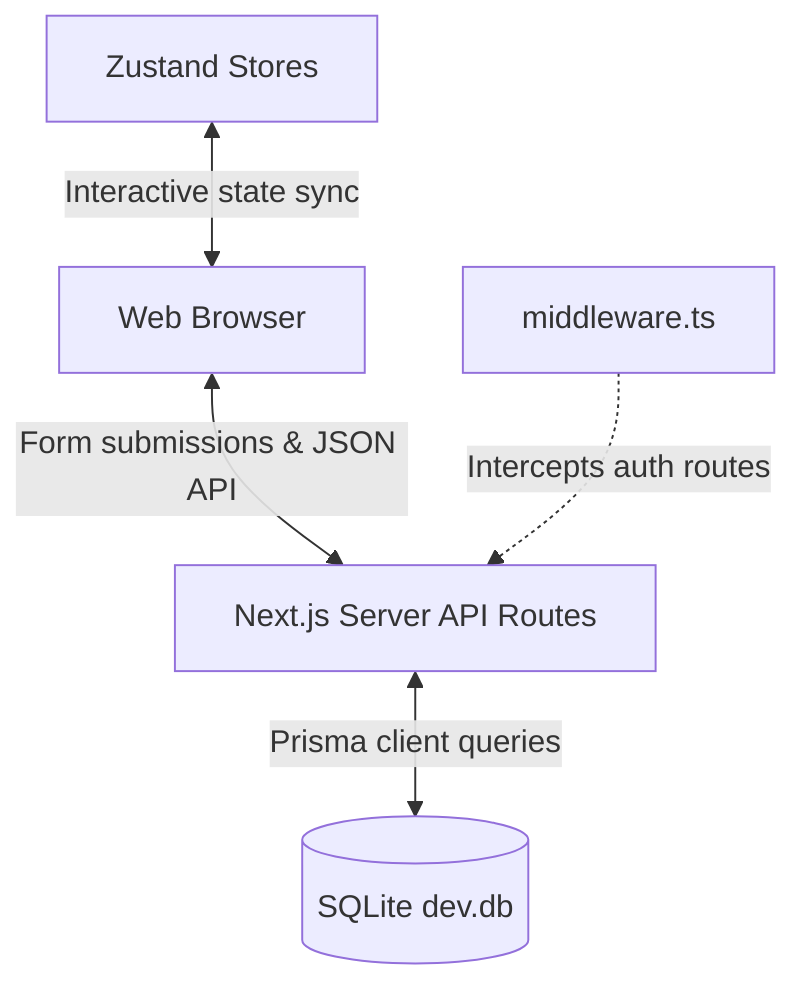

### Component Architecture Diagram
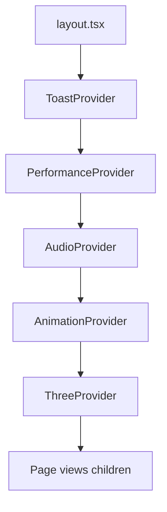

### Project Maturity Estimates

*   **Overall Completion**: **82%**
*   **Frontend**: **92%** (All user-facing pages are complete. Some admin components are missing).
*   **Backend**: **85%** (APIs for login and enquiries are complete. CMS endpoints are missing).
*   **Admin Panel**: **50%** (Overview and enquiries are complete. Content, team, and settings pages are missing).
*   **Database**: **90%** (Database is configured and seeded. Lacks relations).
*   **Performance Optimization**: **95%** (Hardware diagnostics and FPS-based quality scaling are working).
*   **Assets**: **40%** (Video and main graphics are present. Audio assets and team avatars are missing).
*   **Maturity Level**: **Beta**. The user interface and core enquiry workflows are complete, but administrative pages and asset files are missing.
