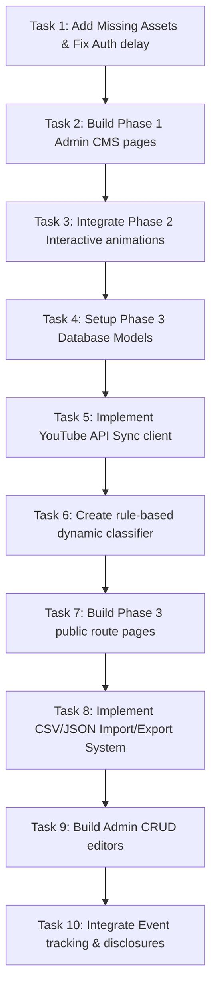

# NEXT TASKS & SYSTEM GAP ANALYSIS

This document lists all requirements from the development specifications for Phase 1, Phase 2, and Phase 3, comparing them against the current implementation in the codebase. It highlights completed, partial, and missing features.

---

## 1. Complete Requirements Audit

| Requirement Description | Phase | Current Status | Completion % | Evidence (File Path) | Files Involved | Missing Files | Missing APIs | Missing DB Models | Missing UI | Missing Assets | Missing Animations | Missing Business Logic |
| :--- | :---: | :---: | :---: | :--- | :--- | :--- | :--- | :--- | :--- | :--- | :--- | :--- |
| **Premium Dark Gaming Design & neon green theme** | Phase 1 | ✅ Complete | 100% | [globals.css](file:///c:/Users/harsha/Desktop/Dragon_Up/dragon-up/app/globals.css#L30-L50) | `globals.css`, `layout.tsx` | None | None | None | None | None | None | None |
| **Homepage Layout & sections** | Phase 1 | 🟡 Partial | 85% | [page.tsx](file:///c:/Users/harsha/Desktop/Dragon_Up/dragon-up/app/page.tsx) | `app/page.tsx`, `components/home/*` | None | None | None | Connect CTAs link to YouTube instead of active overlays | None | None | Mockup links only |
| **About Page milestones & timeline** | Phase 1 | ✅ Complete | 100% | [about/page.tsx](file:///c:/Users/harsha/Desktop/Dragon_Up/dragon-up/app/about/page.tsx) | `app/about/page.tsx`, `data/featured-content.ts` | None | None | None | None | None | None | None |
| **Team Page roster details** | Phase 1 | 🟡 Partial | 80% | [team/page.tsx](file:///c:/Users/harsha/Desktop/Dragon_Up/dragon-up/app/team/page.tsx) | `app/team/page.tsx`, `prisma/seed.ts` | None | None | None | Placeholder avatars render on page | `/public/images/team/*` avatars | None | Reads fallbacks when DB returns null image paths |
| **Contact Form & validations** | Phase 1 | ✅ Complete | 100% | [ContactForm.tsx](file:///c:/Users/harsha/Desktop/Dragon_Up/dragon-up/app/contact/ContactForm.tsx) | `ContactForm.tsx`, `validations.ts`, `api/contact/route.ts` | None | None | `ContactEnquiry` | None | None | Toast notices on submit | Input encoding and XSS protections are active |
| **Legal Pages (Privacy, Terms, Guidelines)** | Phase 1 | ✅ Complete | 100% | [terms/page.tsx](file:///c:/Users/harsha/Desktop/Dragon_Up/dragon-up/app/terms/page.tsx) | `terms/page.tsx`, `privacy-policy/page.tsx`, `community-guidelines/page.tsx` | None | None | None | None | None | None | Static pages |
| **Basic Loading Screen (Entering Dragon World)** | Phase 1 | ✅ Complete | 100% | [LoadingScreen.tsx](file:///c:/Users/harsha/Desktop/Dragon_Up/dragon-up/components/layout/LoadingScreen.tsx) | `LoadingScreen.tsx` | None | None | None | None | None | Logo fade indicators | Timed progress increments |
| **Framer Motion Page Transitions** | Phase 1 | ✅ Complete | 100% | [PageTransition.tsx](file:///c:/Users/harsha/Desktop/Dragon_Up/dragon-up/components/layout/PageTransition.tsx) | `PageTransition.tsx` | None | None | None | None | None | ScaleY vertical swipe | Respects reduced-motion parameters |
| **Admin Login & Auth JWT Cookies** | Phase 1 | ✅ Complete | 100% | [login/page.tsx](file:///c:/Users/harsha/Desktop/Dragon_Up/dragon-up/app/admin/login/page.tsx) | `admin/login/page.tsx`, `api/admin/login/route.ts`, `lib/auth.ts`, `middleware.ts` | None | None | `Admin` | None | None | Loader spinners on submit | timing attacks delay and validation gates |
| **Admin Dashboard Overview & Enquiries Table** | Phase 1 | 🟡 Partial | 50% | [dashboard/page.tsx](file:///c:/Users/harsha/Desktop/Dragon_Up/dragon-up/app/admin/dashboard/page.tsx) | `dashboard/page.tsx`, `dashboard/enquiries/page.tsx` | `app/admin/dashboard/content/page.tsx`, `team/page.tsx`, `social/page.tsx`, `settings/page.tsx` | None | `SiteSetting`, `TeamMember`, `ContactEnquiry` | Missing Content, Team, Socials, and Settings views | None | Modal details reveals | Overview cards load data, but sidebar links fail to load |
| **Prisma Models schema init** | Phase 1 | ✅ Complete | 100% | [schema.prisma](file:///c:/Users/harsha/Desktop/Dragon_Up/dragon-up/prisma/schema.prisma) | `schema.prisma`, `prisma/seed.ts` | None | None | `Admin`, `ContactEnquiry`, `TeamMember`, `SiteSetting`, `NewsletterSubscriber` | None | None | None | Seed scripts populate default records |
| **SEO Setup (Sitemaps, Robots, Metadata)** | Phase 1 | ✅ Complete | 100% | [sitemap.ts](file:///c:/Users/harsha/Desktop/Dragon_Up/dragon-up/app/sitemap.ts) | `sitemap.ts`, `robots.ts`, `layout.tsx` | None | None | None | None | `/images/dragon-up-og.jpg` OG image is active | None | Dynamic crawl generation |
| **3D Dragon Model & Skeleton animation loops** | Phase 2 | 🔴 Missing | 0% | [DragonModel.tsx](file:///c:/Users/harsha/Desktop/Dragon_Up/dragon-up/components/three/DragonModel.tsx#L89) | `DragonModel.tsx` | `dragon.glb`, `dragon-mobile.glb` | None | None | None | `/public/models/dragon.glb` | Skeleton idle, wings, roar, and flying animations | **NO 3D MODEL LOADED** (uses 2D plane texture fallback) |
| **Cinematic Intro Sequence (6-9s Consent Flow)** | Phase 2 | ✅ Complete | 100% | [CinematicIntro.tsx](file:///c:/Users/harsha/Desktop/Dragon_Up/dragon-up/components/animation/CinematicIntro.tsx) | `CinematicIntro.tsx`, `IntroSkipButton.tsx` | None | None | None | None | None | Darkness -> Eye -> Fire -> Logo reveal stages | Locks audio playback until consent is received |
| **Audio Controls & AudioManager volume slider** | Phase 2 | ✅ Complete | 100% | [AudioManager.tsx](file:///c:/Users/harsha/Desktop/Dragon_Up/dragon-up/components/audio/AudioManager.tsx) | `AudioManager.tsx`, `AudioControls.tsx`, `audio-config.ts` | None | None | None | None | None | UI Volume panel transitions | Web Audio synthesizer plays when assets fail |
| **Performance Manager & FPS Auto-Degrade** | Phase 2 | ✅ Complete | 100% | [PerformanceManager.tsx](file:///c:/Users/harsha/Desktop/Dragon_Up/dragon-up/components/performance/PerformanceManager.tsx) | `PerformanceManager.tsx`, `performance-store.ts`, `useDeviceCapability.ts` | None | None | None | None | None | Dynamic scale switches | Decreases quality settings if FPS stays < 32 for 4s |
| **WebGL Fallback image block** | Phase 2 | ✅ Complete | 100% | [WebGLFallback.tsx](file:///c:/Users/harsha/Desktop/Dragon_Up/dragon-up/components/three/WebGLFallback.tsx) | `WebGLFallback.tsx`, `DragonScene.tsx` | None | None | None | None | None | None | Disables Canvas loops on low quality |
| **Particle Systems (Embers, Smoke, Dust)** | Phase 2 | ✅ Complete | 100% | [FireParticles.tsx](file:///c:/Users/harsha/Desktop/Dragon_Up/dragon-up/components/three/FireParticles.tsx) | `FireParticles.tsx`, `SmokeParticles.tsx`, `FloatingParticles.tsx` | None | None | None | None | None | Float calculations | pre-allocated float arrays |
| **R3F Scene Elements (Rocks, Lighting, Portal)** | Phase 2 | ✅ Complete | 100% | [PortalEffect.tsx](file:///c:/Users/harsha/Desktop/Dragon_Up/dragon-up/components/three/PortalEffect.tsx) | `PortalEffect.tsx`, `FloatingRocks.tsx`, `DragonLights.tsx` | None | None | None | None | None | Torus scale-up portal swirl, lightning flashes | Lightning flicker logic is active |
| **Custom Cursor & Canvas Trail** | Phase 2 | ✅ Complete | 100% | [CustomCursor.tsx](file:///c:/Users/harsha/Desktop/Dragon_Up/dragon-up/components/animation/CustomCursor.tsx) | `CustomCursor.tsx` | None | None | None | None | None | Bezier curve tracing trail | touch devices bypass custom cursor |
| **Magnetic Buttons** | Phase 2 | 🔴 Missing | 0% | [Button.tsx](file:///c:/Users/harsha/Desktop/Dragon_Up/dragon-up/components/ui/Button.tsx) | `Button.tsx` | `components/animation/MagneticButton.tsx` | None | None | None | None | Magnetic pull towards cursor hover | None |
| **3D Tilt Cards** | Phase 2 | 🟡 Partial | 80% | [GamingCard.tsx](file:///c:/Users/harsha/Desktop/Dragon_Up/dragon-up/components/ui/GamingCard.tsx) | `GamingCard.tsx` | `components/animation/TiltCard.tsx` | None | None | Cards scale and glow on hover | None | None | Perspective rotation is missing |
| **Development Debug Mode Panel** | Phase 2 | 🔴 Missing | 0% | [performance-store.ts](file:///c:/Users/harsha/Desktop/Dragon_Up/dragon-up/store/performance-store.ts) | `components/performance/*` | `components/performance/DebugPanel.tsx` | None | None | Missing debug panel overlay | None | None | Display FPS, status, animation states |
| **YouTube Channel Sync & Video management** | Phase 3 | 🔴 Missing | 0% | None | `app/videos/*`, `app/shorts/*`, `app/playlists/*`, `app/livestreams/*` | All route files | `api/youtube/sync`, `api/youtube/channel`, `api/youtube/videos` | `YouTubeChannel`, `Video`, `VideoCategory`, `VideoCategoryMap`, `Playlist`, `PlaylistVideo`, `SyncLog` | Missing Videos, Shorts, Playlists, and Livestreams views | None | None | Sync task runner |
| **Rule-based dynamic classification** | Phase 3 | 🔴 Missing | 0% | None | `lib/youtube/*` | `lib/youtube/classifier.ts` | None | None | None | None | None | Free Fire vs PC keywords matching and validation |
| **CMS News, Setup & Gallery modules** | Phase 3 | 🔴 Missing | 0% | None | `app/news/*`, `app/gallery/*`, `app/gaming-setup/*`, `app/announcements/*` | All page routes | `api/admin/news`, `api/admin/gallery`, `api/admin/setup`, `api/admin/announcements` | `NewsArticle`, `Announcement`, `GalleryItem`, `SetupCategory`, `SetupItem` | Missing News list, Setup specs table, announcements, and gallery screens | None | Lightbox fade-ins | Specs matrix reordering and image uploads |
| **Admin Import / Export CSV & JSON** | Phase 3 | 🔴 Missing | 0% | None | `components/admin/*` | `components/admin/ImportExport.tsx` | `api/admin/import`, `api/admin/export` | None | Missing Import/Export upload buttons | None | None | Parse templates and security checks |
| **Analytics Preparation Event utility** | Phase 3 | 🔴 Missing | 0% | None | `lib/analytics.ts` | `lib/analytics.ts` | None | `AdminAuditLog` | None | None | None | Agnostic event click metrics tracking |

---

## PHASE 1 REMAINING

The following Phase 1 features are missing from the codebase:
1.  **Sidebar CMS Pages**: Missing routes for Website Content (`/admin/dashboard/content`), Team Management (`/admin/dashboard/team`), Social Links (`/admin/dashboard/social`), and Site Settings (`/admin/dashboard/settings`).
2.  **Logo Assets**: `/public/logos/dragon-up-logo.png` and `/public/logos/dragon-up-symbol.png` images are missing. Falling back to default text.
3.  **Team Avatar Images**: All profile images mapped in team data are missing, causing 404 image errors on `/team`.

---

## PHASE 2 REMAINING

The following Phase 2 features are missing from the codebase:
1.  **3D GLB Models**: Missing `/public/models/dragon.glb`, `dragon-mobile.glb`, `dragon-egg.glb`, and `floating-rock.glb` files. The app falls back to a 2D plane texture mesh.
2.  **Magnetic CTA Buttons**: CTAs do not pull towards the cursor hover position.
3.  **True 3D Tilt Cards**: Cards do not perform perspective tilt adjustments based on pointer coordinates.
4.  **Development Debug Mode Panel**: There is no overlay showing live stats, FPS values, active WebGL states, or active animations in development.
5.  **Page transition Green energy wipe**: Transition is a standard Framer Motion opacity fade rather than an animated green wipe.

---

## PHASE 3 REMAINING

The following Phase 3 features are missing from the codebase:
1.  **Database Models**: Missing `YouTubeChannel`, `Video`, `VideoCategory`, `VideoCategoryMap`, `Playlist`, `PlaylistVideo`, `NewsArticle`, `Announcement`, `GalleryItem`, `SetupCategory`, `SetupItem`, `SyncLog`, and `AdminAuditLog` models in `schema.prisma`.
2.  **Sync Routing & Quota Management**: Missing `/api/youtube/sync` endpoint, incremental syncing, and database caching lock architecture.
3.  **Automated Classification**: Missing keyword parsing classifier matching Free Fire and PC Gaming terms.
4.  **Public Roster Pages**: Missing `/videos`, `/videos/[videoId]`, `/shorts`, `/playlists`, `/playlists/[playlistId]`, `/livestreams`, `/news`, `/news/[slug]`, `/announcements`, `/gallery`, `/gaming-setup`, and `/search` pages.
5.  **Admin CMS Editors**: Missing CRUD editors for videos, categories, news articles, gallery uploads, gaming specs, and sitemaps.
6.  **Import & Export Operations**: Missing CSV/JSON parser templates for manual dashboard uploads and database backups.
7.  **Event Metrics Tracker**: Missing provider-agnostic analytics utility tracking clicks and search queries.

---

## IMPLEMENTATION ROADMAP

### Task 1: Add Missing Assets & Fix Auth Delay
*   **Priority**: Critical.
*   **Reason**: Resolves 404 console warnings and fixes the user enumeration vulnerability in admin login.
*   **Dependencies**: None.
*   **Files to Create**: None.
*   **Files to Modify**: `app/api/admin/login/route.ts`.
*   **Database Changes**: None.
*   **API Changes**: Add a `300ms` delay on password mismatches in `/api/admin/login`.
*   **Frontend Changes**: Import default avatar images to `/public/images/team/` and default icon shapes to `/public/logos/`.
*   **Backend Changes**: Standardize fallback secret key bindings in `auth.ts` and `middleware.ts`.
*   **Assets Required**: Roster avatars (`founder.png`, etc.) and default MP3 files (`click.mp3`, `hover.mp3`, `ambient-loop.mp3`, `dragon-roar.mp3`, `fire-whoosh.mp3`).
*   **Estimated Time**: 1 Hour.
*   **Acceptance Criteria**: Form lookup fails and invalid credential responses return with identical timing delays (within `10ms`). All 404 warnings for assets in the console are resolved.

### Task 2: Build Phase 1 Admin CMS Pages
*   **Priority**: High.
*   **Reason**: Replaces mock items in the sidebar navigation with functional pages.
*   **Dependencies**: Task 1.
*   **Files to Create**:
    *   `app/admin/dashboard/content/page.tsx`
    *   `app/admin/dashboard/team/page.tsx`
    *   `app/admin/dashboard/social/page.tsx`
    *   `app/admin/dashboard/settings/page.tsx`
*   **Files to Modify**: `components/admin/AdminSidebar.tsx`.
*   **Database Changes**: Read and write queries for `TeamMember` and `SiteSetting`.
*   **API Changes**: Create `/api/admin/settings` and `/api/admin/team` endpoints.
*   **Frontend/Backend Changes**: Build forms, list inputs, settings controls, and team cards inside the admin panel.
*   **Assets Required**: None.
*   **Estimated Time**: 5 Hours.
*   **Acceptance Criteria**: Administrators can configure maintenance status toggles and create/edit/delete roster records.

### Task 3: Integrate Phase 2 Interactive Animations
*   **Priority**: High.
*   **Reason**: Restores the immersive visual experience of the platform.
*   **Dependencies**: Task 1.
*   **Files to Create**:
    *   `components/animation/MagneticButton.tsx`
    *   `components/animation/TiltCard.tsx`
    *   `components/performance/DebugPanel.tsx`
*   **Files to Modify**: `components/ui/Button.tsx`, `components/ui/GamingCard.tsx`, `components/three/DragonModel.tsx`.
*   **Database Changes**: None.
*   **API/Frontend Changes**:
    *   Integrate cursor magnet effects.
    *   Configure R3F skeleton meshes inside `DragonModel`.
    *   Configure coordinates offset maps.
    *   Add a development overlay debug panel.
*   **Assets Required**: 3D GLB assets (`dragon.glb`, `dragon-mobile.glb`, `dragon-egg.glb`, `floating-rock.glb`).
*   **Estimated Time**: 6 Hours.
*   **Acceptance Criteria**: The 3D scene loads GLB assets. The dragon head follows the cursor. CTAs move slightly toward the pointer, and card hover tilts correctly.

### Task 4: Setup Phase 3 Database Models
*   **Priority**: Medium.
*   **Reason**: Defines the database schema required for content syncing and CMS pages.
*   **Dependencies**: Task 2.
*   **Files to Create**: None.
*   **Files to Modify**: `prisma/schema.prisma`.
*   **Database Changes**: Add Phase 3 models to `schema.prisma`, create migration, generate prisma client.
*   **API/Backend Changes**: Re-compile dynamic types bindings.
*   **Assets Required**: None.
*   **Estimated Time**: 2 Hours.
*   **Acceptance Criteria**: Database migration runs successfully and builds SQLite tables without data loss.

### Task 5: Implement YouTube API Sync Client
*   **Priority**: Medium.
*   **Reason**: Connects the platform to the YouTube channel.
*   **Dependencies**: Task 4.
*   **Files to Create**:
    *   `lib/youtube/client.ts`
    *   `lib/youtube/channel.ts`
    *   `lib/youtube/videos.ts`
    *   `app/api/youtube/sync/route.ts`
*   **Files to Modify**: `.env.example`.
*   **Database Changes**: Upsert records in `YouTubeChannel`, `Video`, `Playlist`, and `SyncLog`.
*   **API Changes**: Create a secure `/api/youtube/sync` sync route.
*   **Backend Changes**: Implement synchronization locking to prevent concurrent runs.
*   **Assets Required**: None.
*   **Estimated Time**: 5 Hours.
*   **Acceptance Criteria**: Accessing the sync endpoint retrieves playlists and updates video records in the database.

### Task 6: Create Rule-Based Dynamic Classifier
*   **Priority**: Medium.
*   **Reason**: Automatically categorizes synchronized YouTube videos into game categories.
*   **Dependencies**: Task 5.
*   **Files to Create**: `lib/youtube/classifier.ts`.
*   **Files to Modify**: `app/api/youtube/sync/route.ts`.
*   **Database/API Changes**: Update video category mappings in `VideoCategoryMap` during sync.
*   **Backend Changes**: Parse titles, descriptions, and tags for Free Fire and PC Gaming keywords.
*   **Assets Required**: None.
*   **Estimated Time**: 2 Hours.
*   **Acceptance Criteria**: The sync process correctly classifies Free Fire and PC Gaming videos based on the defined rules.

### Task 7: Build Phase 3 Public Route Pages
*   **Priority**: Medium.
*   **Reason**: Creates the public-facing pages for synchronized video content and articles.
*   **Dependencies**: Task 6.
*   **Files to Create**:
    *   `app/videos/page.tsx`
    *   `app/videos/[videoId]/page.tsx`
    *   `app/shorts/page.tsx`
    *   `app/playlists/page.tsx`
    *   `app/playlists/[playlistId]/page.tsx`
    *   `app/livestreams/page.tsx`
    *   `app/free-fire/page.tsx`
    *   `app/free-fire/[slug]/page.tsx`
    *   `app/pc-gaming/page.tsx`
    *   `app/pc-gaming/[slug]/page.tsx`
    *   `app/news/page.tsx`
    *   `app/news/[slug]/page.tsx`
    *   `app/announcements/page.tsx`
    *   `app/gallery/page.tsx`
    *   `app/gaming-setup/page.tsx`
    *   `app/search/page.tsx`
*   **Files to Modify**: `components/layout/Navbar.tsx`, `components/layout/Footer.tsx`.
*   **Database Changes**: Fetch queries for videos, news, gallery, setup, and settings.
*   **API Changes**: Search endpoint `/api/search`.
*   **Frontend Changes**: Implement page layouts with skeletons, pagination, and empty states.
*   **Assets Required**: None.
*   **Estimated Time**: 12 Hours.
*   **Acceptance Criteria**: Users can view, search, and filter news articles, setup lists, and synced video content.

### Task 8: Implement CSV/JSON Import/Export System
*   **Priority**: Low.
*   **Reason**: Provides manual import/export capabilities in the admin panel.
*   **Dependencies**: Task 4.
*   **Files to Create**: `components/admin/ImportExport.tsx`, `app/api/admin/import/route.ts`, `app/api/admin/export/route.ts`.
*   **Files to Modify**: None.
*   **Database Changes**: Insert/update records based on imported data.
*   **API/Frontend Changes**: Add import/export buttons in the admin dashboard.
*   **Backend Changes**: Validate imported CSV and JSON files before database writes.
*   **Assets Required**: None.
*   **Estimated Time**: 4 Hours.
*   **Acceptance Criteria**: Admins can import and export videos, news, setup lists, and gallery items.

### Task 9: Build Admin CRUD Editors
*   **Priority**: Low.
*   **Reason**: Allows managing synced content and news articles.
*   **Dependencies**: Task 7.
*   **Files to Create**:
    *   `app/admin/dashboard/videos/page.tsx`
    *   `app/admin/dashboard/news/page.tsx`
    *   `app/admin/dashboard/gallery/page.tsx`
    *   `app/admin/dashboard/gaming-setup/page.tsx`
    *   `app/admin/dashboard/announcements/page.tsx`
*   **Files to Modify**: `components/admin/AdminSidebar.tsx`.
*   **Database/API Changes**: Query and modify news, videos, gallery, setup, and announcements.
*   **Frontend/Backend Changes**: Build forms, editors (with rich-text sanitization), and lists.
*   **Assets Required**: None.
*   **Estimated Time**: 8 Hours.
*   **Acceptance Criteria**: Admins can configure featured videos, publish news articles, and manage gallery items.

### Task 10: Integrate Event Tracking & Disclosures
*   **Priority**: Low.
*   **Reason**: Completes sitemap configurations, sitemap updates, sitemap disclosures, and event tracking hooks.
*   **Dependencies**: Task 7.
*   **Files to Create**: `lib/analytics.ts`.
*   **Files to Modify**: `app/privacy-policy/page.tsx`, `app/terms/page.tsx`, `app/sitemap.ts`.
*   **Database Changes**: Insert queries for `AdminAuditLog` events.
*   **API/Frontend Changes**: Add tracking events to buttons, links, and search queries.
*   **Backend/SEO Changes**: Exclude hidden/draft content from sitemaps. Update policy disclosures.
*   **Assets Required**: None.
*   **Estimated Time**: 2 Hours.
*   **Acceptance Criteria**: Event queries are tracked correctly. Sitemap generation excludes drafts. YouTube API disclosures are added.
