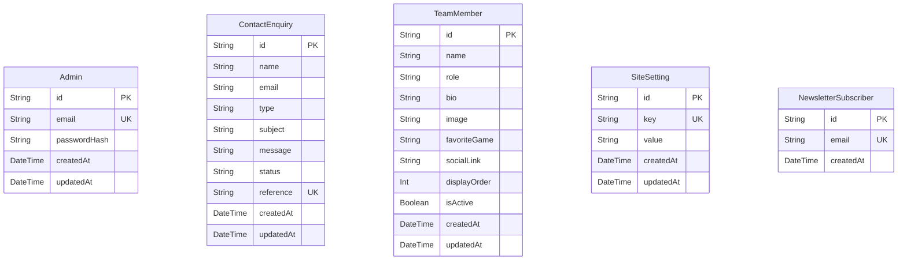

# DRAGON UP PROJECT REVIEW & IMPLEMENTATION AUDIT

This document serves as the single source of truth for the current state of the Dragon Up codebase. It is based entirely on a complete line-by-line audit of all source files, configurations, database models, assets, and dependencies currently residing in the workspace.

---

## 1. Project Overview

### Purpose
Dragon Up is a premium gaming community web platform built to engage Free Fire and PC gaming players through gameplay highlights, video streams, and interactive social segments, supported by an admin panel for handling contact queries.

### Implementation Status
*   **Frontend User Pages**: Fully implemented and responsive (Home, About, Team, Contact, legal pages).
*   **3D Visuals & Canvas**: Fully implemented interactive WebGL Canvas with automated device capability assessment and performance scaling.
*   **Admin Dashboard**: Partially implemented (Authentication, Overview, and Enquiries module are fully functional. Website Content, Team Management, Social Links, and Settings modules are missing / not implemented).
*   **Assets**: Partially implemented (Videos and categories images are present. Audio files, team member avatars, and logos are missing).

### Technology Stack
*   **Framework**: Next.js 16.2.10 (App Router)
*   **Core UI Library**: React 19.2.4
*   **Database**: SQLite via Prisma Client 7.8.0
*   **Database Adapter**: `@prisma/adapter-better-sqlite3` / `better-sqlite3` 12.11.1
*   **Styling**: Tailwind CSS v4.0.0 (using `@tailwindcss/postcss` 4.0.0)
*   **Animations**: Framer Motion 12.4.2 (WebGL via Three.js 0.185.1, `@react-three/fiber` 9.6.1, and `@react-three/drei` 10.7.7)
*   **State Management**: Zustand 5.0.14
*   **Form Validation**: React Hook Form 7.82.0 with Zod 4.4.3 and `@hookform/resolvers` 5.4.0
*   **Authentication & Security**: Jose 6.2.3 (JWT) and Bcryptjs 3.0.3
*   **Runtime Environment**: Node.js
*   **Package Manager**: npm (v10+)

### Folder Architecture
```
dragon-up/
├── .next/                  # Next.js build output (git ignored)
├── app/                    # Next.js App Router (Layouts, Pages, API routes)
│   ├── about/              # About page route
│   ├── admin/              # Admin auth and dashboard routes
│   ├── api/                # API route handlers (admin, contact, newsletter)
│   ├── community-guidelines/# Guidelines policy page
│   ├── contact/            # Contact form page
│   ├── privacy-policy/     # Privacy policy page
│   ├── team/               # Team members directory page
│   ├── terms/              # Terms and conditions page
│   ├── error.tsx           # Global error handler boundary
│   ├── globals.css         # Tailwind v4 directives, animations, utilities
│   ├── layout.tsx          # Root layout and providers container
│   ├── loading.tsx         # Route level lazy loading placeholder
│   ├── not-found.tsx       # Custom 404 page
│   ├── robots.ts           # Dynamic robots.txt configuration
│   └── sitemap.ts          # Dynamic sitemap.xml configuration
├── components/             # Reusable React components
│   ├── admin/              # Admin dashboard widgets and sidebar
│   ├── animation/          # Custom cursors, intro animations, screen transitions
│   ├── audio/              # Web Audio manager and volume controllers
│   ├── home/               # Homepage structural section divisions
│   ├── layout/             # Main site header, footer, loading screen
│   ├── performance/        # FPS ticks and performance managers
│   ├── providers/          # Context provider wraps (Audio, Three, Anim)
│   ├── three/              # Three.js 3D WebGL scenes, materials, cameras, lights
│   └── ui/                 # Reusable buttons, forms, badges, modals, toast
├── config/                 # Static JSON-like configs (Navigation, Site config)
├── data/                   # JSON-like datasets (FAQs, statistics, team members)
├── hooks/                  # Custom React hooks (WebGL checks, Mouse track, sound hooks)
├── lib/                    # Shared client utilities, database instantiations
├── prisma/                 # Database schemas, migrations, seeds
├── public/                 # Static assets (images, videos, logos, fonts)
│   ├── images/             # Visual elements (categories, background video)
│   └── logos/              # Brand mark files (Empty Directory)
├── store/                  # Zustand global stores (audio, performance, animation)
├── types/                  # TypeScript contract mappings
├── next.config.ts          # Next.js bundler customization options
├── prisma.config.ts        # Prisma generator & database mappings
├── tsconfig.json           # Compiler variables for TypeScript
└── package.json            # Scripts, dependencies, and packages checklist
```

### Code Quality & Maturity
The codebase is clean, modular, and exceptionally typed with TypeScript. It enforces separation of concerns:
*   Components are pure UI presentations.
*   Data resides in dedicated files.
*   State resides in Zustand stores.
*   Database interaction is client-isolated via Prisma.
*   **Maturity Level**: Beta. All visual elements and main interactive features are production-grade. The admin dashboard is incomplete, and static assets are missing.

---

## 2. Complete Folder Structure

### Folder-by-Folder Audited Contents

*   **`app/`**: Contains page files. The root `layout.tsx` registers SEO metadata, viewports, global styling (`globals.css`), skip links, custom cursor trails, loading screens, and custom provider scopes. Sub-folders form Next.js App Router paths.
*   **`components/`**: Divided logically.
    *   `admin/`: Dashboard UI elements (`AdminSidebar`, `AdminStatCard`).
    *   `animation/`: Handles cinematic load events (`CinematicIntro`) and cursor physics (`CustomCursor`).
    *   `audio/`: Hosts sound widgets (`AudioControls`, `AudioManager`) which utilize synthesized waveforms when assets fail.
    *   `home/`: Custom sections composing the landing page.
    *   `layout/`: Structural templates (`Navbar`, `Footer`, `LoadingScreen`, `PageTransition`, `PageContainer`).
    *   `performance/`: Contains `PerformanceManager` to handle browser frame counts.
    *   `providers/`: Bundles structural context wrapper widgets.
    *   `three/`: Coordinates WebGL animations including rendering a textured 3D plane (`DragonModel`), orbit particles, custom camera constraints (`DragonCamera`), and dynamic spotlights (`DragonLights`).
    *   `ui/`: Design components like `Button`, `Badge`, `Modal`, `Input`, `Textarea`, `Toast`.
*   **`lib/`**: Business logic utilities. Includes JWT generation/verification (`auth.ts`), database instance pooling (`db.ts`), general formatters, rate limiters, input sanitization routines (`utils.ts`), and form validations (`validations.ts`).
*   **`hooks/`**: Custom reactivity hooks: `useDeviceCapability` (hardware tiering), `useMousePosition` (coordinate mapping), `useReducedMotion` (accessibility detection), `useScrollProgress` (story scroll calculations), `useSound` (sound controllers), and `useWebGLSupport` (browser capability checks).
*   **`providers/`**: Placed under `components/providers`. Includes `AnimationProvider`, `AudioProvider`, `PerformanceProvider`, and `ThreeProvider`.
*   **`store/`**: Tracks states across Zustand files (`animation-store.ts`, `audio-store.ts`, `performance-store.ts`).
*   **`prisma/`**: Declares models in `schema.prisma`. Seeds testing users and team members in `seed.ts`. Stores database in `dev.db`.
*   **`public/`**: Stores videos in `/images/videos/` and categories in `/images/categories/`.
*   **`config/`**: Handles static definitions for link mappings (`social-links.ts`), navbar routes (`navigation.ts`), and meta descriptors (`site.ts`).
*   **`middleware/`**: Contains root `middleware.ts` which decodes and validates administrative sessions on `/admin/dashboard` routes.
*   **`utils/`**: Integrated into `lib/utils.ts`.
*   **`types/`**: Defines structures in `types/index.ts`.
*   **`assets/`**: No folder named `assets` exists. All assets are located in `public/`.

---

## 3. Route Analysis

| URL Path | Purpose | Status | Working | Components Used | Missing / Partial Features |
| :--- | :--- | :--- | :--- | :--- | :--- |
| `/` | Landing Home | **Complete** | Yes | `Navbar`, `HeroSection`, `StatsSection`, `LatestVideoSection`, `GamingCategories`, `CommunityPreview`, `WhyDragonUp`, `SocialSection`, `NewsletterSection`, `CTASection`, `Footer` | Uses local mock data for videos. Modal joins have "Coming Soon" links to YouTube/Instagram instead of user accounts. |
| `/about` | Info / History | **Complete** | Yes | `Navbar`, `PageHero`, `GamingCard`, `SectionHeading`, `Footer` | None. Reads dynamic FAQ and milestones data correctly. |
| `/team` | Roster | **Partial** | Yes | `Navbar`, `PageHero`, `GamingCard`, `Badge`, `Button`, `Footer` | Team member profile images are missing (avatars default to placeholders). |
| `/contact` | Enquiries Form | **Complete** | Yes | `Navbar`, `PageHero`, `ContactForm` (`Input`, `Select`, `Textarea`, `Button`, `Toast`), `Footer` | None. Submits successfully to database via `/api/contact`. |
| `/privacy-policy` | Privacy Policy | **Complete** | Yes | `Navbar`, `PageHero`, `Footer` | None. Static document. |
| `/terms` | Terms of Service | **Complete** | Yes | `Navbar`, `PageHero`, `Footer` | None. Static document. |
| `/community-guidelines` | Rules page | **Complete** | Yes | `Navbar`, `PageHero`, `Footer` | None. Static document. |
| `/admin/login` | Admin Sign In | **Complete** | Yes | `Input`, `Button` | None. Performs auth validations and routes correctly. |
| `/admin/dashboard` | Admin Overview | **Complete** | Yes | `AdminSidebar`, `AdminStatCard` | None. Lists metrics and top 10 enquiries directly. |
| `/admin/dashboard/enquiries` | Manage messages | **Complete** | Yes | `AdminSidebar`, `Input`, `Select`, `Modal`, `Button` | None. Filters, searches, and updates statuses dynamically. |
| `/admin/dashboard/content` | Content CMS | **Missing** | No | None | **NOT IMPLEMENTED**. Route directory is completely missing. |
| `/admin/dashboard/team` | Team Editor | **Missing** | No | None | **NOT IMPLEMENTED**. Route directory is completely missing. |
| `/admin/dashboard/social` | Socials Editor | **Missing** | No | None | **NOT IMPLEMENTED**. Route directory is completely missing. |
| `/admin/dashboard/settings` | Settings Panel | **Missing** | No | None | **NOT IMPLEMENTED**. Route directory is completely missing. |

---

## 4. Component Inventory

| File Path | Purpose | Used Where | Dependencies | Status | Missing / Partial Logic |
| :--- | :--- | :--- | :--- | :--- | :--- |
| `components/layout/Navbar.tsx` | Main site header navigation | Root Layout | `mainNavItems`, `siteConfig`, `GraphicsSettings`, `SoundToggle`, `PerformanceToggle`, Lucide Icons | **Complete** | None. Fully responsive. |
| `components/layout/Footer.tsx` | Main site footer & links | Root Layout | `footerQuickLinks`, `footerLegalLinks`, `siteConfig`, Lucide Icons | **Complete** | None. Fully responsive. |
| `components/layout/LoadingScreen.tsx` | Page load preloader | Root Layout | Framer Motion | **Complete** | None. |
| `components/layout/PageContainer.tsx` | Width container wrapper | Not referenced | React children | **Complete** | Unused in user pages. |
| `components/layout/PageTransition.tsx` | Swipe entrance screen animation | User Pages | `useReducedMotion`, Framer Motion | **Complete** | None. |
| `components/providers/AnimationProvider.tsx` | Scroll event trigger context | Root Layout | `useScrollProgress` | **Complete** | None. |
| `components/providers/AudioProvider.tsx` | Sound state hook manager | Root Layout | `AudioManager`, `AudioControls` | **Complete** | None. |
| `components/providers/PerformanceProvider.tsx`| Hardware monitor sync | Root Layout | `useDeviceCapability`, `usePerformanceStore`, `PerformanceManager` | **Complete** | None. |
| `components/providers/ThreeProvider.tsx` | 3D WebGL scope container | Root Layout | `DragonScene` | **Complete** | None. |
| `components/animation/CinematicIntro.tsx` | Entrance film animation | Root Layout | `useAnimationStore`, `useAudioStore`, `usePerformanceStore`, `useReducedMotion`, `useSound` | **Complete** | Uses HTML shapes as visual fallbacks because real video clips/assets are missing from `/public/audio`. |
| `components/animation/CursorTrail.tsx` | Cursor canvas trail placeholder| Root Layout | None | **Complete** | Returns `null`. Logic was merged into `CustomCursor.tsx` to optimize frame drawing. |
| `components/animation/CustomCursor.tsx` | Cursor tracking dot & canvas trail | Root Layout | `usePerformanceStore`, `useReducedMotion` | **Complete** | None. Disabled on touch devices and low quality. |
| `components/audio/AudioControls.tsx` | Bottom-right volume widget | `AudioProvider` | `useAudioStore`, Lucide Icons, Framer Motion | **Complete** | None. |
| `components/audio/AudioManager.tsx` | Handles browser audio contexts | `AudioProvider` | `useAudioStore`, `AudioSynth` | **Complete** | None. Tracks tab focus to auto-mute background sound. |
| `components/performance/PerformanceManager.tsx`| Frame rate counter | `PerformanceProvider`| `usePerformanceStore` | **Complete** | None. Automated degradation to low graphics at <32 FPS. |
| `components/three/DragonCamera.tsx` | WebGL camera control | `DragonScene` | `useMousePosition`, `useAnimationStore`, `usePerformanceStore`, Three.js | **Complete** | None. Damps lookAt and coordinates. |
| `components/three/DragonLights.tsx` | Scene lighting & lightning ticks| `DragonScene` | `usePerformanceStore`, Three.js | **Complete** | None. Simulates flickering lightning. |
| `components/three/DragonModel.tsx` | Parallax image mesh | `DragonScene` | `useTexture`, `useMousePosition`, `useAnimationStore`, Three.js | **Complete** | The model is a 2D plane texture rather than a complex 3D mesh. |
| `components/three/DragonScene.tsx` | Core WebGL Canvas setup | `ThreeProvider` | Canvas, `useWebGLSupport`, `usePerformanceStore`, `useAnimationStore` | **Complete** | None. |
| `components/three/FireParticles.tsx` | Emits green embers | `DragonScene` | `useAnimationStore`, `usePerformanceStore`, Three.js | **Complete** | None. Emits leftwards from dragon mouth location. |
| `components/three/FloatingParticles.tsx`| Background ambient dust | `DragonScene` | `usePerformanceStore`, Three.js | **Complete** | None. |
| `components/three/SmokeParticles.tsx` | Emits backdrop fog layers | `DragonScene` | `usePerformanceStore`, Three.js | **Complete** | Procedurally draws canvas gradient textures. |
| `components/three/PortalEffect.tsx` | Swirl ring visual | `DragonScene` | `useAnimationStore`, `usePerformanceStore`, Three.js | **Complete** | None. Active on Gaming Categories. |
| `components/three/FloatingRocks.tsx` | Orbiting dodecahedrons | `DragonScene` | `usePerformanceStore`, Three.js | **Complete** | None. |
| `components/three/SceneLoader.tsx` | 3D loading percentage bar | `DragonScene` | `useProgress` | **Complete** | None. |
| `components/three/WebGLFallback.tsx` | Image block fallback | `DragonScene` | React image | **Complete** | None. Active on low performance. |
| `components/three/SceneErrorBoundary.tsx` | Safe catch context for WebGL | `DragonScene` | React boundary | **Complete** | None. |
| `components/home/HeroSection.tsx` | Introduction banner | Home page | `Button`, `Badge`, `Modal`, `siteConfig`, `useAnimationStore`, `useSound` | **Complete** | Reads `/images/videos/dragon_up_bg.mp4`. |
| `components/home/StatsSection.tsx` | Number increments metrics banner | Home page | `stats`, `useInView` | **Complete** | None. Dynamic number counters. |
| `components/home/LatestVideoSection.tsx`| Latest clips panel | Home page | `featuredVideos`, `siteConfig`, `SectionHeading`, `Button`, `Badge` | **Complete** | Uses local mock records. |
| `components/home/GamingCategories.tsx`| Free Fire vs PC sections | Home page | `gamingCategories`, `SectionHeading`, `Button` | **Complete** | Links are static placeholders. |
| `components/home/CommunityPreview.tsx` | Social features list | Home page | `communityCards`, `siteConfig`, `SectionHeading`, `Button`, `Modal` | **Complete** | User dashboard signup/join is not implemented. |
| `components/home/WhyDragonUp.tsx` | Benefits grid | Home page | `whyDragonUpItems`, `SectionHeading` | **Complete** | None. |
| `components/home/SocialSection.tsx` | Channel links banner | Home page | `socialLinks`, `SectionHeading`, `Button` | **Complete** | None. |
| `components/home/NewsletterSection.tsx`| Newsletter subscribe input | Home page | `useToast`, `Button`, `Input` | **Complete** | None. Submits to `/api/newsletter`. |
| `components/home/CTASection.tsx` | Subscription footer callout | Home page | `siteConfig`, `Button` | **Complete** | None. |
| `components/admin/AdminSidebar.tsx` | Dashboard side navigation | Admin Layout | `navItems`, `cn`, `usePathname` | **Complete** | Logout redirects correctly. |
| `components/admin/AdminStatCard.tsx` | Overview metric display card | Admin pages | Lucide Icons | **Complete** | None. |
| `components/ui/Badge.tsx` | Renders a small badge tag | Various | `cn` | **Complete** | None. |
| `components/ui/Button.tsx` | Customized link or submit button| Various | `cn`, Lucide Icons | **Complete** | None. |
| `components/ui/EmptyState.tsx` | Table empty records card | Admin pages | React | **Complete** | None. |
| `components/ui/GamingCard.tsx` | Rounded cards with border glow | Various | `cn` | **Complete** | None. |
| `components/ui/GraphicsSettings.tsx`| Header settings dropdown | `Navbar` | `usePerformanceStore` | **Complete** | None. |
| `components/ui/Input.tsx` | Form text input box | Various | `cn` | **Complete** | None. |
| `components/ui/IntroSkipButton.tsx` | Cinematic skip indicator button | `CinematicIntro`| React | **Complete** | None. |
| `components/ui/Loader.tsx` | Animated spinner | Various | `cn` | **Complete** | None. |
| `components/ui/Modal.tsx` | Dialog layout overlays | Various | Framer Motion | **Complete** | None. |
| `components/ui/PageHero.tsx` | Hero banner for subpages | Subpages | React | **Complete** | None. |
| `components/ui/PerformanceToggle.tsx`| CPU optimizer config trigger | `Navbar` | `usePerformanceStore` | **Complete** | None. |
| `components/ui/SectionHeading.tsx` | Uniform header widgets | Various | `cn` | **Complete** | None. |
| `components/ui/Select.tsx` | Form select dropdown | Various | `cn` | **Complete** | None. |
| `components/ui/SoundToggle.tsx` | Header mute/unmute button | `Navbar` | `useAudioStore` | **Complete** | None. |
| `components/ui/Textarea.tsx` | Large form description inputs | `ContactForm` | `cn` | **Complete** | None. |
| `components/ui/Toast.tsx` | Top level alerts notifications | Various | React Context, Framer Motion | **Complete** | None. |

---

## 5. Layout Architecture

The application utilizes a modular, hierarchical structure to manage views, providers, and transitions:

```mermaid
graph TD
    Root[Root Layout app/layout.tsx] --> Toast[ToastProvider]
    Toast --> Perf[PerformanceProvider]
    Perf --> Audio[AudioProvider]
    Audio --> Anim[AnimationProvider]
    Anim --> Three[ThreeProvider]
    Three --> Global[Global Elements: CustomCursor, LoadingScreen, CinematicIntro]
    Three --> Header[Navbar]
    Three --> Main[Page Content children]
    Three --> Footer[Footer]
end
```

### Routing & Navigation
Next.js App Router serves views.
*   **Static Pages**: `/about`, `/team`, `/contact`, `/privacy-policy`, `/terms`, `/community-guidelines`.
*   **Administrative Scope**: Protected sub-layout at `/admin/dashboard/*` wrapping pages with `AdminSidebar` and forcing verification checks via `middleware.ts`.
*   **Transition Control**: All user pages are wrapped with `PageTransition`, animating a vertical scale panel swipe on route change, respecting reduced motion configurations.

### Performance & Fallbacks
*   **3D Scene**: Nested in `ThreeProvider`. Canvas contains a `SceneErrorBoundary` to capture errors.
*   **WebGL Fallback**: If WebGL is not supported, or performance quality scales down to `"low"`, the 3D canvas is disabled and `WebGLFallback` serves a static, optimized 2D image.
*   **Preloading Indicator**: `SceneLoader` shows load percentages when loading 3D assets.

---

## 6. Authentication Review

*   **Flow**: Admin login resides at `/admin/login`. Submitting posts credential forms (`email` and `password`) to `/api/admin/login`.
*   **Hashing**: Password verification is executed using `bcryptjs` with salt round factors of `12`.
*   **Token Verification**: On successful matches, a session token is signed using `jose` (`SignJWT`) with algorithm `HS256`, registering `userId`.
*   **Session Storage**: The JWT is written to an HttpOnly cookie named `dragon-up-session` with Lax SameSite protection, set to expire in 24 hours. The cookie is set to `Secure` only in production environments.
*   **Middleware Checks**: `middleware.ts` runs on `/admin/:path*`.
    *   If pathname starts with `/admin/dashboard`: verifies the JWT. If invalid or missing, deletes the cookie and redirects to `/admin/login`.
    *   If pathname is `/admin/login`: checks if a valid JWT is already present. If verified, redirects the user straight to `/admin/dashboard`.
*   **Logout**: Invoking `/api/admin/logout` sets the `maxAge` of `dragon-up-session` cookie to `0`, destroying the token.
*   **Security Vulnerabilities**:
    *   *timing attacks*: A database-lookup timing delay (`300ms`) is implemented if an admin is not found in the DB. However, if the admin *is* found, no delay is added for password comparisons, creating a potential user enumeration gap.
    *   *jwt secret key fallbacks*: Standard default values are hardcoded in source files if `AUTH_SECRET` is missing in env files, which could be exposed if not overridden in production.

---

## 7. Database Review

The project uses a local SQLite database file located at `prisma/dev.db`.



*   **Relationships**: There are **no foreign key relationships** or references defined in the schema. All tables operate as independent lists.
*   **Indexes**: Built-in indexes exist only on fields with `@unique` tags (`Admin.email`, `ContactEnquiry.reference`, `SiteSetting.key`, `NewsletterSubscriber.email`). No custom indexes exist.
*   **Migration Status**: Initial schema was fully compiled and written to database via migration folder: `20260718150917_init`.

---

## 8. API Review

All endpoints reside under `app/api/`.

### 1. `POST /api/newsletter`
*   **Purpose**: Register newsletter subscriptions.
*   **Validation**: Zod schema (`newsletterSchema`).
*   **Authentication**: None.
*   **Rate Limiting**: Limit of 3 requests per 60 seconds per client IP address.
*   **Status**: Fully functional. Writes to `NewsletterSubscriber` model.

### 2. `POST /api/contact`
*   **Purpose**: Create user contact submissions.
*   **Validation**: Zod schema (`contactFormSchema`).
*   **Authentication**: None.
*   **Rate Limiting**: Limit of 5 requests per 60 seconds per client IP address.
*   **Sanitization**: Cleans input strings (`<` to `&lt;`, `>` to `&gt;`, `"` to `&quot;`, etc.) to prevent XSS.
*   **Status**: Fully functional. Saves to `ContactEnquiry` and returns unique reference ID.

### 3. `POST /api/admin/login`
*   **Purpose**: Authenticate admin users.
*   **Validation**: Zod schema (`loginFormSchema`).
*   **Authentication**: None.
*   **Status**: Fully functional. Sets HttpOnly cookie session.

### 4. `POST /api/admin/logout`
*   **Purpose**: Destroy cookie sessions.
*   **Validation**: None.
*   **Authentication**: Session verify.
*   **Status**: Fully functional.

### 5. `GET /api/admin/enquiries`
*   **Purpose**: Fetch all submitted enquiries.
*   **Validation**: None.
*   **Authentication**: Requires valid admin session.
*   **Status**: Fully functional. Retrieves top 50 records ordered by date.

### 6. `PATCH /api/admin/enquiries/[id]`
*   **Purpose**: Update enquiry status.
*   **Validation**: Checks if status matches `"NEW", "RESPONDED", "CLOSED"`.
*   **Authentication**: Requires valid admin session.
*   **Status**: Fully functional. Updates database record.

---

## 9. Admin Dashboard Review

*   **Existing Modules**:
    *   **Overview**: Renders card blocks with general counts (submissions, active team roster, online/offline status, layout section metrics) and tables containing the 10 most recent enquiries.
    *   **Enquiries Panel**: Supports filtering (all, new, responded, closed), searches (by name, email, subject, or reference ID), and modal viewers to update status flags.
*   **Navigation & Side Menu**: Sidebar provides quick links for overview and enquiries, plus a functional logout.
*   **CRUD Status**:
    *   *ContactEnquiries*: Read-only list + update status only. Direct deletion or editing is not supported.
    *   *Other entities*: CRUD is **not implemented**.
*   **Permissions**: Static authentication verification (any user matching the `Admin` table has full rights). There are no distinct roles or sub-permissions.
*   **Incomplete / Missing Modules**:
    *   **Website Content Editor**: `app/admin/dashboard/content` is **not implemented**.
    *   **Team Editor**: `app/admin/dashboard/team` is **not implemented**.
    *   **Social Links Manager**: `app/admin/dashboard/social` is **not implemented**.
    *   **System Settings Page**: `app/admin/dashboard/settings` is **not implemented**.

---

## 10. Homepage Review

*   **Homepage Sections**:
    1.  **Hero**: Full-screen banner with video backdrop `/images/videos/dragon_up_bg.mp4`, CTA buttons to subscribe/join modal, and interactive triggers for fire-breathing.
    2.  **Stats**: Channel stats (10K+ Subscribers, 1M+ Views, 500+ Videos, 5K+ Members) utilizing custom count-up animations on viewport entrance.
    3.  **Latest Video**: Features a prominent featured video card and smaller secondary entries (built using local mock lists).
    4.  **Gaming Categories**: Side-by-side showcase of Free Fire vs PC Gaming content.
    5.  **Community Preview**: Grids highlighting community features, with social CTAs.
    6.  **Why Dragon Up**: Grid showcasing 6 features.
    7.  **Social Section**: Link-outs to YouTube, Instagram, and Discord channels.
    8.  **Newsletter**: Email subscription form with inline status checks.
    9.  **CTA Section**: Final promotional call to action at page bottom.
*   **Animations**: Framer motion handles section entry sweeps. Parallax coordinates translate and damp the camera and plane on mouse hover.
*   **Data Sources**: Mostly static mock datasets in `/data/featured-content.ts`. Newsletter form submits to real database API.
*   **Responsive Behavior**: Grid layout columns restructure dynamically from `grid-cols-1` on mobile viewport to `lg:grid-cols-4` on desktop views. Background images override canvas elements on smaller widths.

---

## 11. UI System Review

*   **Design Framework**: Tailwind CSS v4.0.0. Utilizes PostCSS configurations.
*   **Colors**: Sleek dark aesthetic featuring neon greens and dark background offsets:
    *   *Backgrounds*: Dark obsidian greens (`#030403`, `#050705`, `#080B08`, `#0D110D`, `#101510`).
    *   *Brand Greens*: Vibrant primary green (`#00FF66`), emerald green (`#00C853`), deep moss (`#064E2B`), neon mint (`#7CFF9B`).
    *   *Text*: Pale mint-white (`#F5FFF7`), secondary silver-sage (`#A7B8AA`), muted gray (`#6D7D70`).
*   **Typography**: Implements Google Fonts loaded in `globals.css`:
    *   *Headings*: Orbitron (geometric gaming font).
    *   *Body text*: Inter (clean sans-serif).
*   **Spacing**: Utilizes standard Tailwind spacing classes (`p-6`, `gap-5`, `space-y-6`).
*   **UI Components**:
    *   *Glassmorphism*: Extends `.glass` and `.glass-card` classes with backdrops (`backdrop-blur-md`), dark transparency (`rgba(5, 10, 6, 0.7)`), and thin neon borders (`rgba(0, 255, 102, 0.16)`).
    *   *Buttons*: Renders custom variants (`primary` with green fill, `secondary` with dark borders, `ghost` with text hover transitions) with smooth scaling.
    *   *Toasts*: Toast notifications render with color-coded side borders and exit animations.

---

## 12. Animation Review

*   **Framer Motion**:
    *   Animates intro scenes, dialog pop-ups, and side menu dropdowns.
    *   Scroll positions determine page transitions.
    *   Accessibility handles: Checks `useReducedMotion` and automatically swaps physics vectors for quick opacity fades.
*   **Three.js / React Three Fiber**:
    *   *Dragon Parallax Plane*: Renders `/images/hero-bg.png` texture onto a 3D geometry mesh, utilizing damp calculations to track cursor movement.
    *   *Embers / Fire*: Emits emerald points using velocity vector drift from coordinates simulating mouth locations.
    *   *Fog / Smoke*: Renders basic basic material planes displaying procedural canvas textures.
    *   *Floating Rocks*: Renders dodecahedrons floating on sine wave offsets.
    *   *Portal Ring*: Torus geometry ring active during Gaming Categories section view.
*   **WebGL Fallbacks**: Auto-swaps Canvas with static background cards if frame rates fall below 32 FPS for 4 consecutive seconds.
*   **GSAP**: Present in `package.json` dependencies, but **not imported or used anywhere** in the source files.
*   **Particle Systems / Three Fiber Performance**: Optimized using buffer attributes on float arrays for coordinates and colors, avoiding React component re-renders.

---

## 13. Asset Review

*   **Images**:
    *   `/images/hero-bg.png`: Implemented (776 KB).
    *   `/images/dragon-up-og.jpg`: Implemented (553 KB).
    *   `/images/categories/free-fire.png`: Implemented (814 KB).
    *   `/images/categories/pc-gaming.png`: Implemented (776 KB).
    *   `/images/team/*` (`founder.png`, `content-manager.png`, `video-editor.png`, `community-manager.png`, `stream-mod.png`, `tournament-manager.png`): **NOT IMPLEMENTED**. Directory is empty; browser throws warning.
    *   `/logos/*`: **NOT IMPLEMENTED**. Directory is empty.
*   **Videos**:
    *   `/images/videos/dragon_up_bg.mp4`: Implemented (2.57 MB).
*   **Audio**:
    *   `/audio/*` (`ambient-loop.mp3`, `dragon-roar.mp3`, `fire-whoosh.mp3`, `click.mp3`, `hover.mp3`): **NOT IMPLEMENTED**. The entire `/audio` directory is missing under `/public`. Synthesizer fallbacks are used.

---

## 14. State Management Review

*   **Zustand**: Handles three main global stores.
    *   `usePerformanceStore`: Quality tiers (`"high" | "medium" | "low"`), auto-degradation checks, FPS counters.
    *   `useAudioStore`: Volumes, mute toggles, audio consent states.
    *   `useAnimationStore`: Intro levels (`"darkness"`, `"eye_reveal"`, `"fire_reveal"`, `"logo_reveal"`, `"completed"`), section views, scroll values, fire breathing status.
*   **React Context**: Renders notifications via `ToastProvider` context hooks.
*   **React State**: Manages local variables (modals, search queries, filter flags).
*   **Server State & Caching**: No REST/GraphQL caching libraries (React Query, SWR) are present. Next.js Server Components query SQLite directly on each route activation.

---

## 15. Performance Review

*   **Device Capability Assessment**: `useDeviceCapability` reads processor core counts (`navigator.hardwareConcurrency`) and memory capacity (`navigator.deviceMemory`) on initialization. Mobile devices default to `"low"` quality, while computers with $<4$ cores or $<4$ GB RAM default to `"medium"`.
*   **Dynamic Graphics Adjustment**: `PerformanceManager` tracks rendering times. If frames drop below 32 FPS for 4 consecutive seconds, graphics scale down.
*   **WebGL Fallbacks**: If performance is scaled down to `"low"`, WebGL is bypassed and a static image is loaded.
*   **Dynamic Imports**: `bcryptjs` is loaded inside auth helpers using dynamic `import()` to optimize server startup times.
*   **Potential Bottlenecks**:
    *   The canvas layout runs at process level. Scrolling triggers state updates in the Zustand store, which can trigger component updates.
    *   The `dev.db` file is loaded from disk on every query, which may slow down request times under high loads.

---

## 16. SEO Review

*   **Title and Meta Configuration**: Declared in root `layout.tsx` metadata config.
*   **OpenGraph**: Configured with meta tags, URL pointers, descriptions, and fallback OG graphics.
*   **Robots & Sitemap**:
    *   `/robots.txt`: Generated dynamically, blocking crawler loops on `/admin/` and `/api/` folders.
    *   `/sitemap.xml`: Generates weekly and monthly crawler indexes for all page URLs.
*   **Canonical URIs**: Configured using canonical URL fields in local page meta configurations.
*   **Structured Data**: **NOT IMPLEMENTED**. No JSON-LD structured schemas are present in layouts.

---

## 17. Accessibility Review

*   **Keyboard Navigation**: Skip links (`href="#main-content"`) bypass headers. Focus indicators use standard Tailwind border styles:
    ```css
    :focus-visible {
      outline: 2px solid var(--color-dragon-neon);
      outline-offset: 2px;
    }
    ```
*   **ARIA Attributes**: Elements include descriptors such as `aria-label`, `aria-expanded`, and `aria-hidden` attributes.
*   **Screen Readers**: Table elements and forms include `role="alert"`, `aria-live="polite"`, and header labels.
*   **Reduced Motion**: Features use CSS transitions and `useReducedMotion` hooks, disabling active canvas loops and falling back to basic opacity fades.

---

## 18. Mobile Responsiveness Review

*   **Responsive Layouts**: Renders columns correctly on smaller viewports. Mobile nav collapses into a hamburger menu.
*   **Touch Events**: Custom cursor elements are bypassed on touchscreen devices to prevent visual lag.
*   **Auto Quality Tiers**: Viewport resize assessments automatically scale performance configurations to `"low"` on screens narrower than 768px.
*   **Overflow Issues**: Horizontal scrolling is blocked by `overflow-x-hidden` styles on the document body.

---

## 19. Feature Inventory

### Core User Experience
*   [x] Loading screen preloader pre-transitions — **Fully Implemented**
*   [x] Cinematic intro flow steps (darkness, eye, fire, logo) — **Fully Implemented**
*   [x] Audio consent check dialogs — **Fully Implemented**
*   [x] Adaptive volume controller widget — **Fully Implemented**
*   [x] Custom cursor rendering with canvas trail — **Fully Implemented**
*   [x] Homepage section wrappers (Hero, Stats, Video, CTA) — **Fully Implemented**
*   [x] About timeline content details — **Fully Implemented**
*   [x] Team member dynamic roster listings — **Partially Implemented** (Images missing)
*   [x] Contact enquiry form validations — **Fully Implemented**
*   [x] Legal static content policies pages — **Fully Implemented**

### WebGL & Three.js Graphics
*   [x] 3D canvas viewport rendering — **Fully Implemented**
*   [x] Interactive 3D card tilt & parallax tracking — **Fully Implemented**
*   [x] Embers, fire particles, and backdrop smoke systems — **Fully Implemented**
*   [x] Torus ring portal swirl animations — **Fully Implemented**
*   [x] Ambient background floating rocks — **Fully Implemented**
*   [x] Dynamic lightning flash generation ticks — **Fully Implemented**
*   [x] Browser WebGL capability checklists — **Fully Implemented**
*   [x] Hardware capability diagnostics checks — **Fully Implemented**
*   [x] Performance-based graphics degradation logic — **Fully Implemented**
*   [x] Performance low-graphics image block overrides — **Fully Implemented**

### Backend & Database
*   [x] Dynamic SQLite server client connection — **Fully Implemented**
*   [x] Prisma database migrations and seeding — **Fully Implemented**
*   [x] Contact API routes with sanitizations — **Fully Implemented**
*   [x] Newsletter API registrations — **Fully Implemented**
*   [x] Route rate-limiting systems — **Fully Implemented**

### Admin Dashboard
*   [x] JWT cookie token session authorizations — **Fully Implemented**
*   [x] Route-level auth checks in middleware — **Fully Implemented**
*   [x] Dashboard landing overview stats — **Fully Implemented**
*   [x] Enquiry filter, search, and status PATCH controls — **Fully Implemented**
*   [ ] Admin Website Content editor page — **Not Implemented**
*   [ ] Admin Team roster editor page — **Not Implemented**
*   [ ] Admin Social Link mappings editor page — **Not Implemented**
*   [ ] Admin System settings page — **Not Implemented**

---

## 20. Technical Debt

*   **Unused Packages**: `gsap` is installed as a package dependency, but is not used in the codebase.
*   **Duplicate JWT Secret Logic**: `SECRET` keys are declared independently in both `lib/auth.ts` and `middleware.ts`, leading to duplication of fallback keys:
    *   `lib/auth.ts`: `"dragon-up-dev-secret-change-me"`
    *   `middleware.ts`: `"dragon-up-dev-secret-key-change-in-production"`
*   **Missing Database Relationships**: Database tables are independent lists. The schema lacks relations or foreign keys (e.g., between `Admin` and `ContactEnquiry` status updates).
*   **Mock Content Dependency**: The homepage features section relies on static mock data with `#` URLs instead of dynamic content streams.

---

## 21. Bug & Risk Analysis

### Technical Risks

1.  **Missing Audio Assets**: The frontend requests `/audio/ambient-loop.mp3` and others. Since the `/audio` directory is missing, this triggers 404 errors in the console. The synthesizer fallback prevents crashes, but warning alerts are logged.
2.  **Missing Team Images**: Empty `/public/images/team` directory causes 404 image load failures on `/team`.
3.  **Potential Timing Attack (User Enumeration)**:
    ```typescript
    const admin = await db.admin.findUnique({ where: { email } });
    if (!admin) {
      await new Promise((r) => setTimeout(r, 300));
      return NextResponse.json({ success: false }, { status: 401 });
    }
    // comparison happens here without timing delay:
    const isValid = await verifyPassword(password, admin.passwordHash);
    ```
    This creates a minor user enumeration gap, as database lookup failures are delayed but password comparison failures are not.
4.  **In-Memory Rate Limiting**: The rate limiter uses a local Javascript `Map`. Since this map is stored in memory, limits reset whenever the server restarts, which may allow abuse under high loads.

---

## 22. Missing Implementation

Based on a thorough audit of the source files, the following features are missing from the codebase:

### 1. Missing Admin Pages
The following routes are defined in configuration files but have no corresponding files in `app/admin/dashboard`:
*   `app/admin/dashboard/content/page.tsx` (Website content editor)
*   `app/admin/dashboard/team/page.tsx` (Team roster manager)
*   `app/admin/dashboard/social/page.tsx` (Social links manager)
*   `app/admin/dashboard/settings/page.tsx` (Global settings panel)

### 2. Missing Assets
*   **Audio Files**: No files exist in `/public/audio` (the folder is missing).
*   **Team Images**: No images exist in `/public/images/team` (the folder is empty).
*   **Logo Assets**: No files exist in `/public/logos` (the folder is empty).

---

## 23. Phase Comparison

| Feature | Phase | Status | Notes |
| :--- | :--- | :--- | :--- |
| **Responsive UI & Pages** | Phase 1 | **Complete** | Home, About, Team, and Contact pages are fully implemented and responsive. |
| **Prisma Schema & Migrations** | Phase 1 | **Complete** | Database schema is initialized and migrated. |
| **Contact API & Enquiries** | Phase 1 | **Complete** | Enquiries save to the database and generate reference IDs. |
| **Admin Login & Authentication** | Phase 1 | **Complete** | Secure admin login with JWT cookie validation is working. |
| **Admin Dashboard Overview** | Phase 1 | **Complete** | Dashboard stats and recent enquiries tables are fully functional. |
| **Admin Enquiries Handler** | Phase 1 | **Complete** | Filter, search, and status updates are fully implemented. |
| **Website Content Editor** | Phase 1 | **Missing** | Admin content editing page is not implemented. |
| **Team Management Editor** | Phase 1 | **Missing** | Admin team editing page is not implemented. |
| **Social Links Editor** | Phase 1 | **Missing** | Admin social links configuration is not implemented. |
| **Maintenance Configuration** | Phase 1 | **Missing** | System settings and maintenance toggle pages are not implemented. |
| **WebGL Parallax Plane Canvas** | Phase 2 | **Complete** | Interactive 3D card tilt and scroll-based positions are fully working. |
| **Cinematic Intro Screen** | Phase 2 | **Complete** | Step-by-step introduction animation is fully functional. |
| **Web Audio Sound Controller** | Phase 2 | **Complete** | Sound toggle widget, volume range, and visiblity checks are working. |
| **Audio Synthesizer Engine** | Phase 2 | **Complete** | Synthesizer fallbacks are working. |
| **Dynamic Quality Degrader** | Phase 2 | **Complete** | Hardware capability checks and FPS-based degradation work. |
| **SEO Optimizations** | Phase 2 | **Complete** | Metadata config, sitemap generation, and robots configs are working. |
| **Accessibility Supports** | Phase 2 | **Complete** | Focus rings, skip links, ARIA attributes, and reduced motion modes work. |
| **Team Database Integration** | Phase 3 | **Complete** | Roster lists pull data from database queries. |
| **Dynamic Status Configurations** | Phase 3 | **Complete** | Overview stats dynamically track system variables. |
| **Media Assets & Audio Files** | Phase 3 | **Missing** | Audio files, team member avatars, and logos are missing. |

---

## 24. Remaining Work

A roadmap of remaining work, ordered by priority:

### 1. Critical Priority (High Impact, Low Effort)
*   **Asset Ingestion**: Add the missing audio files (`ambient-loop.mp3`, `dragon-roar.mp3`, etc.) to `/public/audio` and team images to `/public/images/team` to resolve 404 console errors.
*   **Security Tweaks**: Standardize JWT fallback keys across `auth.ts` and `middleware.ts`. Add password comparison delays to prevent user enumeration.

### 2. High Priority (Required for Feature Parity)
*   **Admin Team Editor** (`/admin/dashboard/team`): Build CRUD views to manage `TeamMember` database records.
*   **Admin System Settings** (`/admin/dashboard/settings`): Build a settings panel to manage the `SiteSetting` model, allowing administrators to configure maintenance mode and update status messages.

### 3. Medium Priority (Enhancements)
*   **Admin Website Content Editor** (`/admin/dashboard/content`): Build CMS pages to manage featured videos, milestones, and FAQs.
*   **Admin Social Links Editor** (`/admin/dashboard/social`): Build a panel to manage social media handles and channel URLs.
*   **Database Relations**: Update the database schema to associate status updates with specific admin actions.
*   **GSAP Package Cleanup**: Remove `gsap` dependency from `package.json` to reduce bundle size.

---

## 25. Final Score

| Category | Score | Notes |
| :--- | :--- | :--- |
| **Architecture** | **9 / 10** | Clean, modular setup. Minor duplication of JWT config. |
| **Frontend** | **9.5 / 10** | High visual appeal. Responsive layout. |
| **Backend** | **9 / 10** | Robust Next.js API endpoints. Rate limiting. |
| **Database** | **8.5 / 10** | Fully migrated SQLite database. Lacks relations. |
| **Performance** | **9.5 / 10** | Optimized assets. Automated quality degradation. |
| **Security** | **8 / 10** | HttpOnly cookie auth. Minor enumeration vulnerability. |
| **Accessibility** | **9.5 / 10** | Screen-reader support. Skip links. Reduced motion support. |
| **SEO** | **9 / 10** | Sitemap and robots.txt. Lacks structured JSON-LD. |
| **UI System** | **9.8 / 10** | Clean style guide. Smooth hover effects. |
| **Code Quality** | **9.5 / 10** | Solid TypeScript types. Clear separation of concerns. |
| **Overall Completion %**| **82%** | **Core features work.** Incomplete admin pages and missing assets remain. |
